# RAG and Memory

## RAG Architecture

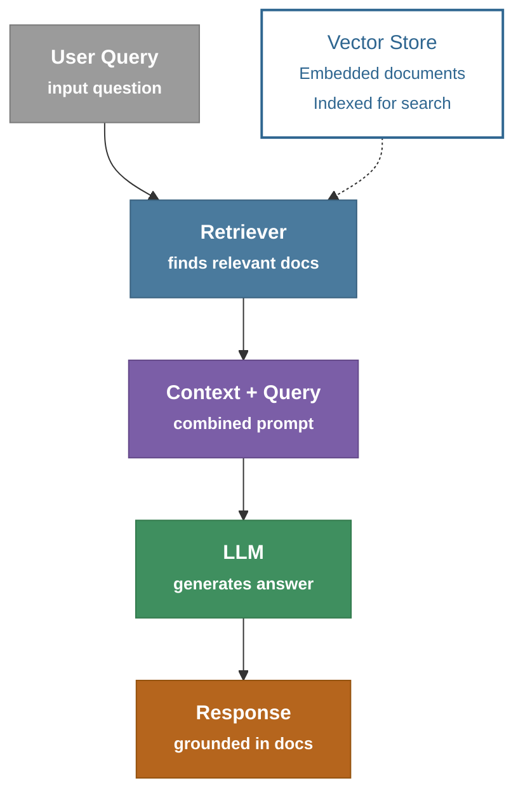

> **Key Concept:** RAG grounds LLM responses in actual documents, reducing hallucination.

> The flow: `User Query → Retriever → Context + Query → LLM → Response`, with the **Retriever** pulling from a **Vector Store** of embedded, indexed documents on the side.

---

## Basic RAG Chain

**Diagram 1 – Chain Structure**

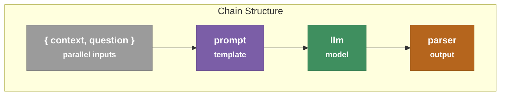

**Diagram 2 – Prompt Template & Parallel Input Processing**

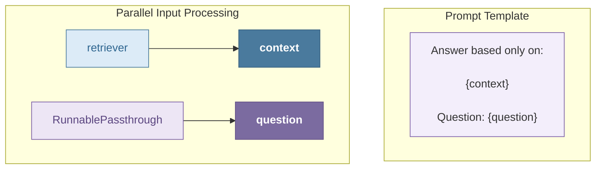

**Notes from the diagram:**

- `context` pulls from the **retriever**, while `question` passes straight through via **RunnablePassthrough** ("Question passes through unchanged").
- The prompt template combines them: *"Answer based only on: {context} — Question: {question}"*.
- Overall chain: `{context, question} → prompt → llm → parser`.

---

## Handling "I Don't Know"

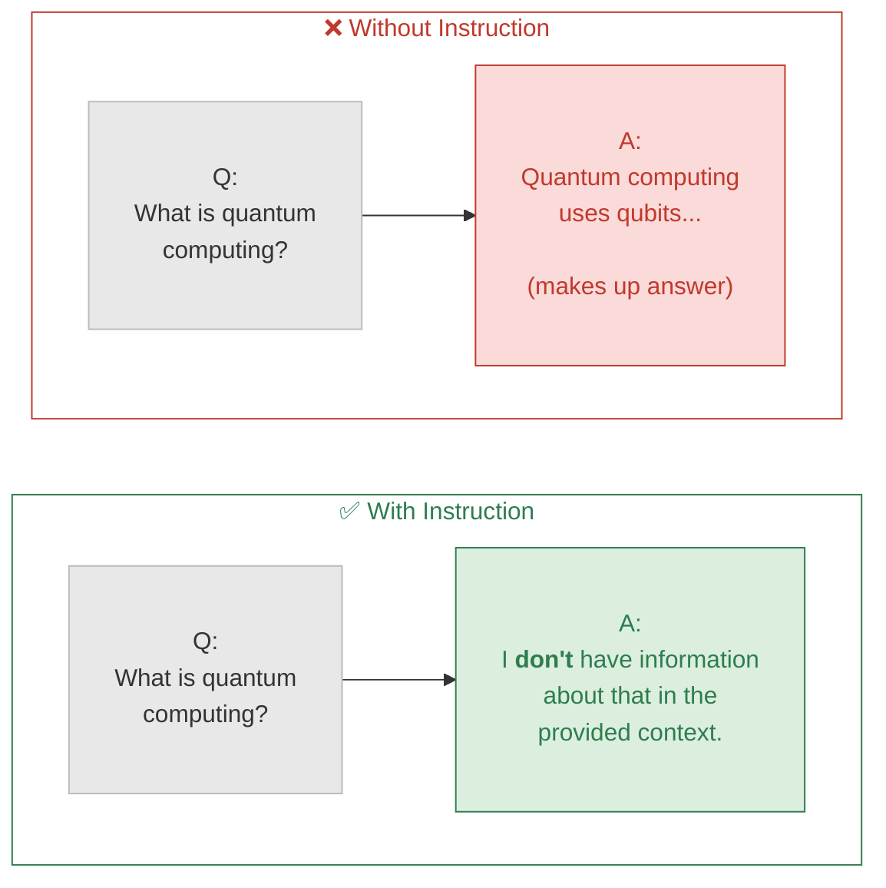

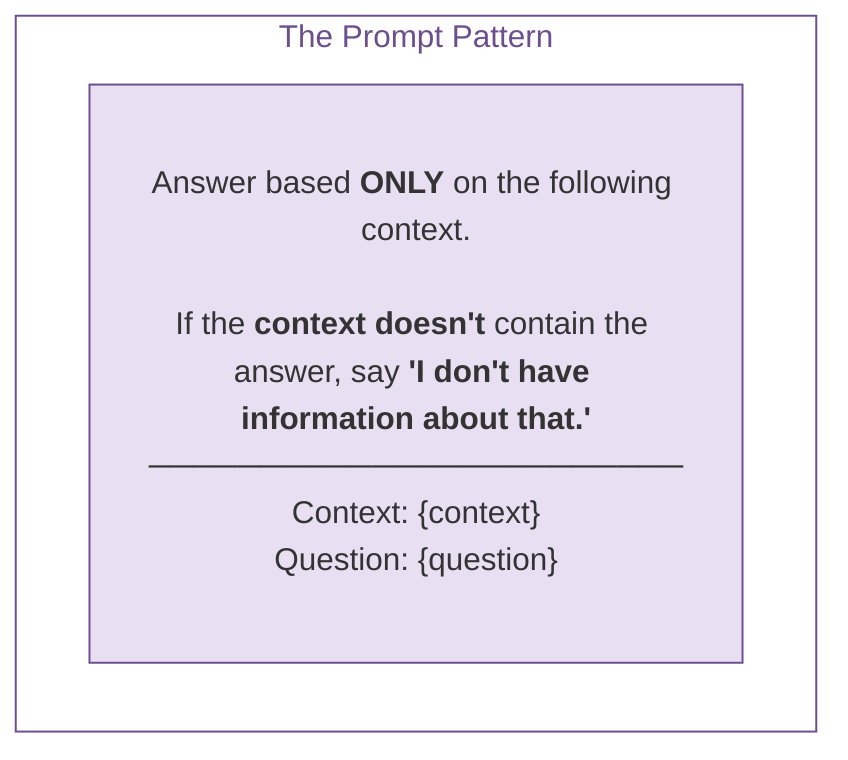

> **Summary:** Without an explicit instruction, the LLM hallucinates an answer even when it lacks the information. Adding an instruction to the prompt ("say *I don't have information about that*") makes the model admit uncertainty instead of fabricating a response. This is achieved through a prompt pattern that constrains the answer strictly to the given context.

---

## RAG with Sources

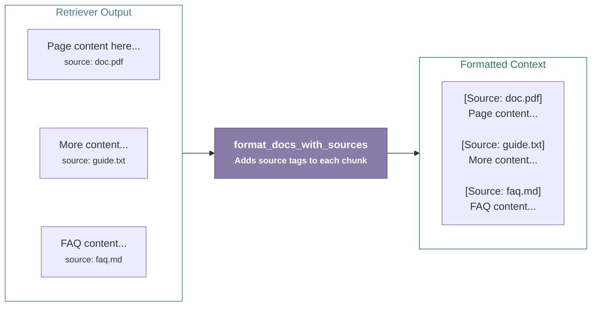

> **Summary:** The `retriever` returns raw document chunks, each tagged with its source. The `format_docs_with_sources` function processes these chunks and attaches a `[Source: ...]` tag to each one, producing a formatted context block that preserves traceability back to the original documents.

> Users can verify answers.  Enable citation in responses. Builds trust. 使用者可驗證回答來源，並在回應中顯示引用（Citation），提升答案的可信度。

```python
  rag_chain = (
    {
      "context": retriever | format_docs_with_sources,
      "question": RunnablePassthrough(),
    }
    | prompt
    | llm
    | StrOutputParser()
  )
```

---

## Hands on Basic RAG

```bash
source .venv/Scripts/activate
cd langchain-course/

pyenv global 3.12.10
pyenv local 3.12.10

uv run rag_pipeline.py
```

> {{context}} 不要被 Python 解讀，而是保留給 LangChain。

---

## 🎯 Advanced RAG

### 🔴 Basic RAG Limitations

| #    | Limitation                         | Impact                          |
| ---- | ---------------------------------- | ------------------------------- |
| 🔴① | **Single query perspective** | → Misses relevant docs         |
| 🔴② | **No metadata filtering**    | → Retrieves irrelevant content |
| 🔴③ | **Full chunks returned**     | → Noise in context             |
| 🔴④ | **Keyword OR semantic**      | → Not both together            |

### 🟢 Advanced RAG Solutions

- 🟣 **Multi-Query Retriever** — Multiple perspectives

````markdown
    Query1 ─┐
    Query2 ─┼──► Vector Store
    Query3 ─┤
    Query4 ─┘
````

- 🔵 **Self-Query Retriever** — Auto metadata filters

````markdown
    Vector Search
    +
    Metadata Filter
````

- 🟠 **Contextual Compression** — Extract relevant parts

    > Chunk 大 + 相關資訊密度低 → compression 值得用（省下的 token/降低干擾 多付出的 LLM 呼叫成本）
    > Chunk 小 + 本來就很聚焦 → compression 通常不划算，純粹增加延遲和費用

```markdown

    - Token 少很多
    - 成本降低
    - 答案更精準
```

- 🟢 **Hybrid Search** — Keywords + semantic

````markdown
# Hybrid Search
                    User Query
                        │
            ┌─────────────┴─────────────┐
            ▼                           ▼
    Keyword Search (BM25)      Vector Search
    找完全匹配文字               找語意相近內容
            │                           │
            └─────────────┬─────────────┘
                        ▼
                Hybrid Ranking
                        ▼
        更完整、更精確的搜尋結果

> BM25: Best Matching 25, Elasticsearch、OpenSearch、Lucene 等搜尋引擎的預設排名演算法。

## Example

        User Query: 
        What fields are required in MT700?
                │
                ▼
        Retriever
        (Vector Search)
                │
                ▼
        Top-3 Retrieved Chunks

        1. Source: SWIFT MT700 Specification
        - Field 20
        - Field 40A
        - Field 31D

        2. Source: Import LC Product Manual
        - MT700 Generation

        3. Source: LC Issue User Guide
        - Issue Screen Mapping

````

| 技術                               | 解決什麼問題           | 實際例子                             |
| ---------------------------------- | ---------------------- | ------------------------------------ |
| 🟣**Multi-Query Retriever**  | 從不同角度搜尋         | 同一個問題產生多個 Query，提高召回率 |
| 🔵**Self-Query Retriever**   | 自動加 Metadata Filter | LLM 自動判斷要搜尋哪些文件           |
| 🟠**Contextual Compression** | 去除無關內容           | 只保留與問題相關的段落               |
| 🟢**Hybrid Search**          | Keyword + Semantic     | 同時利用關鍵字與向量搜尋             |

---

```markdown
# Advanced RAG Architecture

          User Question
               │
               ▼
┌─────────────────────────────┐
│ Multi-Query Retriever       │
│ 同一問題產生多個 Query       │
│ Via LLM                     │
└──────────────┬──────────────┘
               │
               ▼
┌─────────────────────────────┐
│ Self-Query Retriever        │
│ 自動加入 Metadata Filter     │
└──────────────┬──────────────┘
               │
               ▼
┌─────────────────────────────┐
│ Hybrid Search               │
│ Keyword + Vector Search     │
└──────────────┬──────────────┘
               │
               ▼
         Retrieved Documents
               │
               ▼
┌─────────────────────────────┐
│ Contextual Compression      │
│ 移除無關內容，只保留重點      │
└──────────────┬──────────────┘
               │
               ▼
              LLM

```

---

## 🟣 Multi-Query Retriever

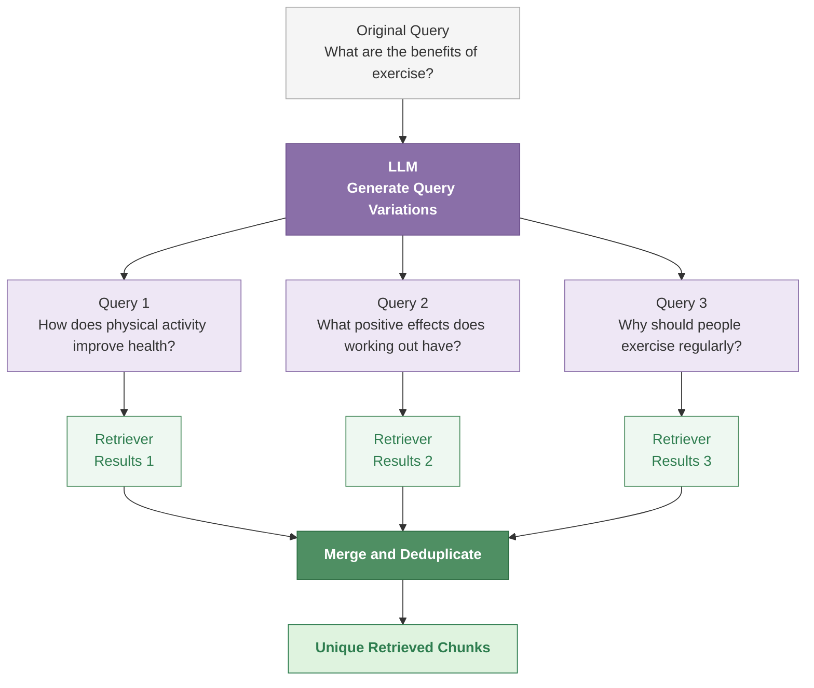

---

## ⚪ Self-Query Retriever

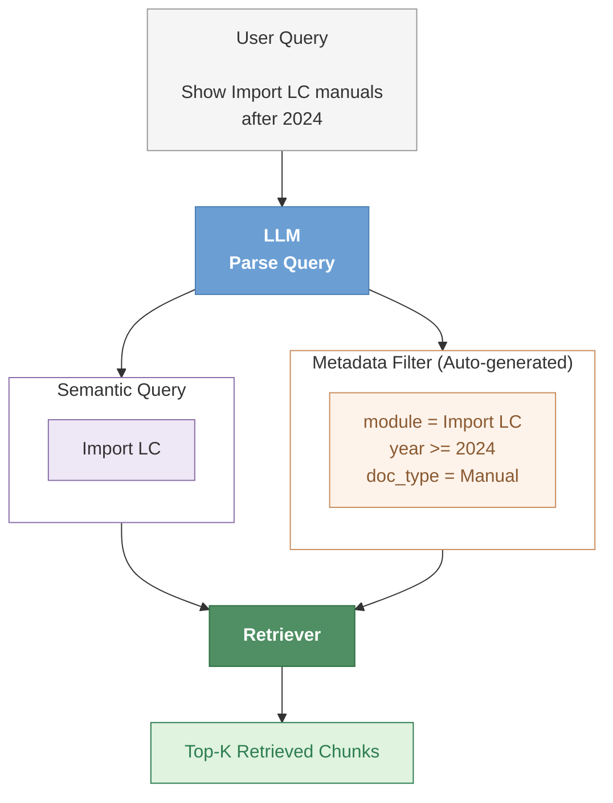
---

## MultiQueryRetriever vs SelfQueryRetriever

| 比較項目          | 🟣 MultiQueryRetriever | 🔵 SelfQueryRetriever           |
| ------------- | ---------------------- | ------------------------------- |
| 核心目的          | 提高 **Recall（召回率）**     | 提高 **Precision（精確率）**           |
| LLM 的工作       | 將一個問題改寫成多個 Query       | 解析問題並產生 Query + **Metadata Filter** |
| 解決問題          | 同一種問法可能找不到所有相關文件       | 文件太多，需要**縮小搜尋**範圍                   |
| 搜尋次數          | **多次**搜尋，再合併結果             | 通常**一次**搜尋，但加入 Filter               |
| 是否使用 Metadata | ❌ 不需要                  | ✅ 需要                            |

### 一句話總結
| Retriever                  | 核心概念                                                                              |
| -------------------------- | --------------------------------------------------------------------------------- |
| 🟣 **MultiQueryRetriever** | **Expand the Query**：將一個問題改寫成多個 Query，提高 **Recall**，避免漏掉相關文件。                     |
| 🔵 **SelfQueryRetriever**  | **Add Metadata Filters**：從問題中推論搜尋條件，自動加入 Metadata Filter，提高 **Precision**，縮小搜尋範圍。 |

---

## Context Compression Retrival

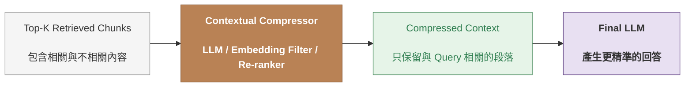

## Hybrid Search (BM25 + Semantic)

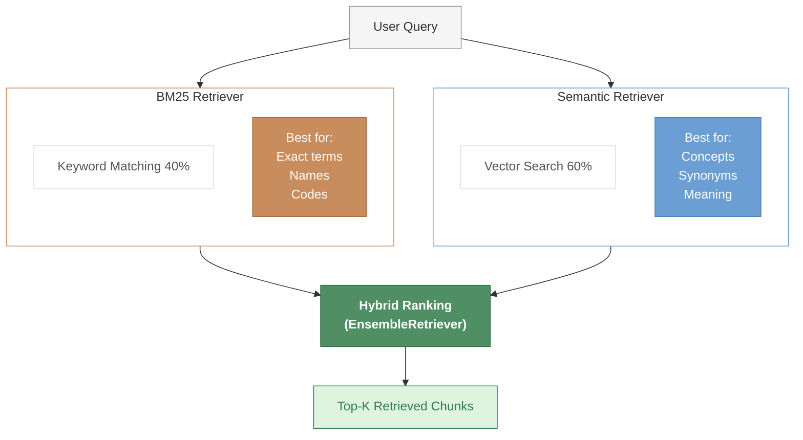

## Parent Document Retriever

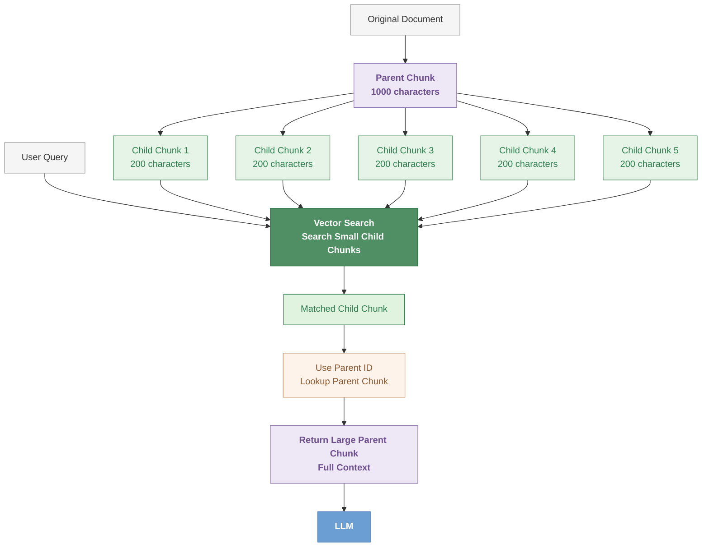

## Hands on Advanced RAG

```bash
source .venv/Scripts/activate
cd langchain-course/

pyenv global 3.12.10
pyenv local 3.12.10

uv run advanced_rag.py
```