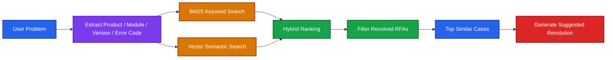

# RAG Retriever 比較

## 1. 單純向量檢索（`vectorstore.as_retriever(search_kwargs={"k": N})`）

- 將 **Query** 轉換成 **Embedding**。
- 與每個 Chunk 的 Embedding 計算 **Cosine Similarity（餘弦相似度）**。
- 取相似度最高的 **Top-K** Chunk。

> 這是最基本的檢索方式，只根據向量距離找最相近的 K 個 Chunk。

---

## 2. BM25Retriever（`advanced_rag.py` 中的 `demo_ensemble_hybrid_search`）

- 不使用 Embedding。
- 採用 **BM25** 演算法，依據：
  - 詞頻（TF）
  - 逆文件頻率（IDF）
- 根據關鍵字重疊程度計算分數。
- 回傳分數最高的 **Top-K** 文件。

> 「靠近」代表的是**文字關鍵字的相似程度**，而不是語意上的接近。

---

## 3. EnsembleRetriever（Hybrid Search）

同時使用：

- BM25（Keyword Search）
- Vector Search（Semantic Search）

並依照權重合併排序，例如：

```python
weights=[0.4, 0.6]
```

表示：

- BM25：40%
- Vector Search：60%

最後依照混合後的分數排序，再取 Top 結果。

> 並不存在單一的距離，而是兩種檢索分數加權後的排序結果。

---

## 4. MultiQueryRetriever

流程如下：

1. LLM 將原始問題改寫成多個不同角度的 Query。
2. 每個 Query 都各自進行向量檢索。
3. 每個 Query 各取 Top-K。
4. 最後將所有結果：
   - 合併（Merge）
   - 去重（Deduplicate）

例如：

```
原始問題
      │
      ▼
LLM 產生 4 個 Query
      │
      ├── Query1 → Top3
      ├── Query2 → Top3
      ├── Query3 → Top3
      └── Query4 → Top3
              │
              ▼
        Merge + Deduplicate
```

因此最終文件數量：

- **不是單一的 k 決定**
- 而是：

```
Query 數 × 每個 Query 的 k
```

再經過去重後得到最終結果。

---

## 5. ParentDocumentRetriever

流程：

1. 對 **Child Chunks** 做 Top-K 向量檢索。
2. 取得每個 Child 的 `doc_id`。
3. 根據 `doc_id` 去重（Deduplicate）。
4. 使用唯一的 `doc_id` 從 `docstore` 取回 Parent Documents。

```text
Vector Search
        │
        ▼
Child 1 (doc_id=abc123)
Child 2 (doc_id=abc123)
Child 3 (doc_id=abc223)
        │
        ▼
ParentDocumentRetriever
        │
 Deduplicate doc_id
        │
        ▼
docstore.mget(["abc123", "abc223"])
        │
        ▼
Parent Documents
```

因此：

- Child Top-K = 3
- Unique `doc_id` = 2
- Parent 回傳數量 = 2

> **重點：** ParentDocumentRetriever 搜尋的是 **Child Chunks**，但回傳的是 **去重後的 Parent Documents**。

---

## 6. ContextualCompressionRetriever

流程：

1. Base Retriever 先取得 Top-K 文件。
2. 不直接回傳。
3. 使用 LLM 對每份文件：
   - 擷取相關段落
   - 移除無關內容
   - 壓縮（Compression）
4. 回傳壓縮後內容。

因此：

- **抓哪些文件** → 由 Base Retriever 的 **k** 決定。
- **回傳哪些內容** → 由 LLM 壓縮器決定。

> 檢索（Retrieval）與內容壓縮（Compression）是兩個不同階段。

---

## 總結

| Retriever | 如何判斷「靠近」 | Top-K 意義 | 是否後處理 |
|------------|------------------|-------------|------------|
| Vector Retriever | Embedding Cosine Similarity | Top-K Chunk | ❌ |
| BM25Retriever | 關鍵字 TF-IDF / BM25 分數 | Top-K 文件 | ❌ |
| EnsembleRetriever | BM25 + Vector 加權分數 | 混合排序後 Top-K | ❌ |
| MultiQueryRetriever | 多個 Query 各自做向量搜尋 | 每個 Query 各自 Top-K | ✅ Merge + Deduplicate |
| ParentDocumentRetriever | Child Chunk 向量搜尋 | Child Top-K | ✅ 回傳 Parent 並去重 |
| ContextualCompressionRetriever | Base Retriever 決定 | Base Retriever Top-K | ✅ LLM 壓縮內容 |

---

### 一句話總結

**`k` 的確控制「抓幾個結果」，但不同 Retriever 對於「如何判斷靠近」（向量距離、關鍵字分數、混合分數）以及「抓到之後是否還要再加工處理」，都有不同的設計與行為。**

---

## RAG Strategy

| RAG Pattern                    | Demo                               | 解決什麼問題                     | 真實使用時機                    |
| ------------------------------ | ---------------------------------- | -------------------------- | ------------------------- |
| MultiQueryRetriever            | `demo_multi_query_retriever()`     | Query 太短、太模糊，容易漏資料         | Enterprise Search、知識庫、FAQ |
| SelfQueryRetriever             | `demo_self_query_retriever()`      | 自動解析 Metadata Filter       | 文件管理、產品型錄、法規查詢            |
| ContextualCompressionRetriever | `demo_contextual_compression()`    | 文件太長，Context 太大            | PDF、Manual、Specification  |
| Ensemble / Hybrid Search       | `demo_ensemble_hybrid_search()`    | Keyword + Semantic 同時搜尋    | Enterprise Search、銀行文件    |
| ParentDocumentRetriever        | `demo_parent_document_retriever()` | Search 小 Chunk、回答大 Context | 長篇技術文件、法規、書籍              |
| Advanced RAG Chain             | `demo_advanced_rag_chain()`        | 結合多種 Retriever             | Production AI Assistant   |

### RFA FAQ

| FAQ 特性           | 建議 Retriever                           | 原因                    |
| ---------------- | -------------------------------------- | --------------------- |
| 問法固定、關鍵字明確       | **BM25**                               | 精準、速度快                |
| 使用者問法很多變         | **Vector Search**                      | 找語意相近問題               |
| 同時有關鍵字與語意        | **Hybrid Search（最推薦）**                 | Recall 與 Precision 最佳 |
| FAQ 有分類、產品、地區等欄位 | **SelfQueryRetriever + Hybrid Search** | 自動加 Metadata Filter   |
| FAQ 很短（一問一答）     | **通常不需要 ParentDocumentRetriever**      | 沒有長文件可還原              |
| FAQ 很長（每題有詳細說明）  | **ParentDocumentRetriever**            | 找到小段，再回完整 FAQ         |



> 一句話總結： RFA Database 最適合使用 Hybrid Search 找到語意相近且關鍵字匹配的歷史案件，再利用 Product、Module、Version、Status 等 Metadata 過濾，最後根據已解決案件產生建議處理方案。

### Vector Store + RAG

| Scenario                  | Vector Store            | Search                          |
| ------------------------- | ----------------------- | ------------------------------- |
| FAQ（小型）                   | Persistent Vector Store | Basic Similarity Search         |
| FAQ（大型）                   | Persistent Vector Store | Hybrid Search                   |
| FAQ（有分類）                  | Persistent Vector Store | Similarity + Metadata Filter    |
| **Request for Assistance**    | Persistent Vector Store | Hybrid Search + Metadata Filter **最推薦** |
| Product Manual            | Persistent Vector Store | ParentDocumentRetriever         |
| Enterprise Knowledge Base | Persistent Vector Store | Advanced RAG                    |

