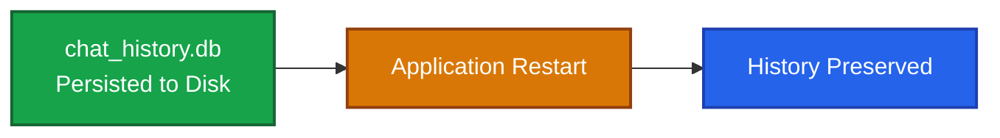

# Memory 

## Memory Evolution in LangChain

### Legacy (deprecated in 0.3.1)
- `ConversationBufferMemory`
- `ConversationSummaryMemory`
- `ConversationBufferWindowMemory`

**Status:** DEPRECATED

### Modern (recommended)
- **`RunnableWithMessageHistory`** — **Primary** approach 
- **Manual message management** — Full control
- **LangGraph state** — For agents

**Status:** RECOMMENDED

```python
store = {}

def get_session_history(session_id: str) -> BaseChatMessageHistory:
    if session_id not in store:
        store[session_id] = InMemoryChatMessageHistory()
    return store[session_id]


chain = prompt | llm | StrOutputParser()

with_message_chain = RunnableWithMessageHistory(
    runnable=chain,
    get_session_history=get_session_history,
    input_messages_key="input",        # <-- 要和 invoke 一致
    history_messages_key="history",
)

messages = [
    "Hi! My name is Paulo.",
    "I'm learning about LangChain.",
    "What's my name and what am I learning?",
]

config = {
    "configurable": {
        "session_id": "user_123"
    }
}

for msg in messages:
    response = with_message_chain.invoke(
        {"input": msg},
        config=config,
    )

    print(response)
```

## Memory Strategies Comparison

| Strategy | Tokens Used | Best For |
|---|---|---|
| Full Buffer | Grows linearly | Short conversations |
| Window (k=5) | Fixed | Long conversations |
| Summary | Grows slowly | Very long conversations |
| Summary + Buffer | Moderate | Balance of detail & context |


### Trim messages

<https://reference.langchain.com/python/langchain-core/messages/utils/trim_messages>

```python
messages = [
    SystemMessage("you're a good assistant, you always respond with a joke."),
    HumanMessage("i wonder why it's called langchain"),
    AIMessage(
        'Well, I guess they thought "WordRope" and "SentenceString" just '
        "didn't have the same ring to it!"
    ),
    HumanMessage("and who is harrison chasing anyways"),
    AIMessage(
        "Hmmm let me think.\n\nWhy, he's probably chasing after the last "
        "cup of coffee in the office!"
    ),
    HumanMessage("what do you call a speechless parrot"),
]

trim_messages(
    messages,
    max_tokens=1000,
    strategy="last",
    token_counter=ChatOpenAI(model="openai:gpt-5.5"),
    # Most chat models expect that chat history starts with either:
    # (1) a HumanMessage or
    # (2) a SystemMessage followed by a HumanMessage
    start_on="human",
    # Usually, we want to keep the SystemMessage
    # if it's present in the original history.
    # The SystemMessage has special instructions for the model.
    include_system=True,
    allow_partial=False,
)
```

#### Trimmed (1000 tokens)

| Role | Content |
|---|---|
| System | You are helpful... |
| User | Recent question |
| AI | Recent answer |

---

### Memory Strategy

#### Memory in RAM


#### Memory in SQLite



#### Usage Pattern


| 顏色        | 意義                                            |
| --------- | --------------------------------------------- |
| 🔵 Blue   | Memory / Session / Storage                    |
| 🟣 Purple | LangChain Component (`SQLChatMessageHistory`) |
| 🟢 Green  | Persistent Storage                            |
| 🟠 Orange | Application Restart                           |
| 🔴 Red    | Data Lost / Error                             |

---

## Memory Hands on

```bash
source .venv/Scripts/activate
cd langchain-course/

pyenv global 3.12.10
pyenv local 3.12.10

uv run conversation_memory.py
```

## Memory Strategy

| Strategy                | Demo                                 | Memory 存放位置               | 真實使用時機                |
| ----------------------- | ------------------------------------ | ------------------------- | --------------------- |
| In-Memory               | `demo_basic_memory()`                | RAM                       | Demo、PoC、單機 Chatbot   |
| Multi Session           | `demo_multi_sessions()`              | RAM（依 session_id）         | Web Chat、多使用者聊天       |
| Message Trimming        | `demo_message_trimming()`            | RAM                       | Context 太長，需要控制 Token |
| Window Memory           | `demo_windowed_memory()`             | RAM（最近 K 次）               | 一般客服聊天，不需完整歷史         |
| Summary Memory          | `demo_summary_memory()`              | RAM (Summary + Recent Messages) | 長時間聊天（例如數百輪）          |
| SQLite Memory           | `exercise_persistent_memory()`       | SQLite                    | 單機開發、桌面應用、小型系統        |
| Persistent Memory Proof | `exercise_persistent_memory_proof()` | SQLite                    | 驗證重啟後仍保留 Memory       |
