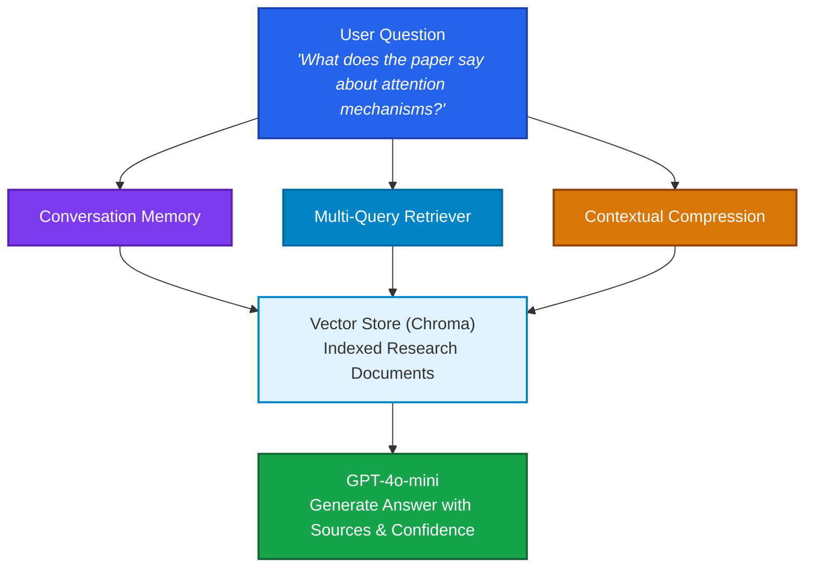
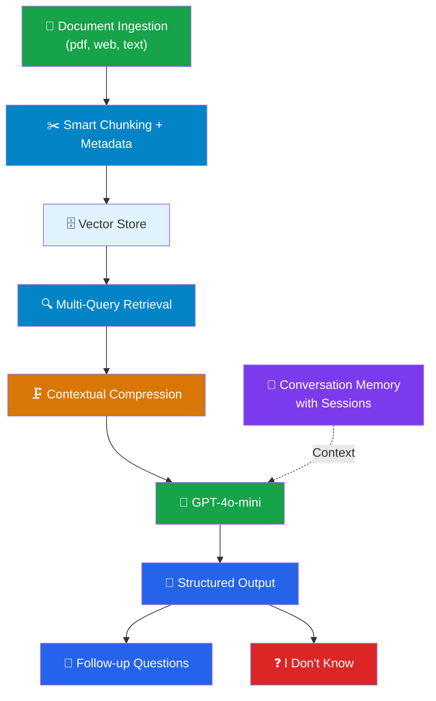
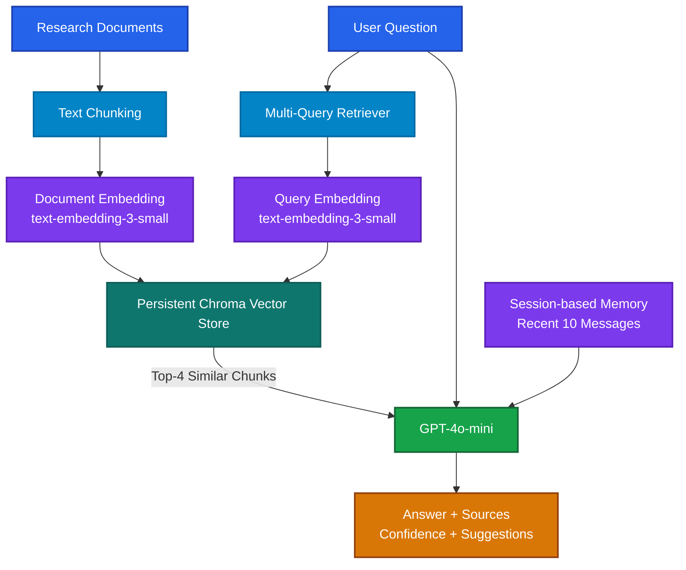

# Project - AI Research Assitance

## Architecture



## Features Checklist (Complete Production Ready RAG Application)



## Key Design Decisions

| Area | Design Decision | Purpose |
|------|-----------------|---------|
| Chunking | `chunk_size=1000`, `chunk_overlap=200` | Preserve document context |
| Embedding | `text-embedding-3-small` | Convert document chunks and queries into vectors for semantic search |
| Vector Store | Persistent Chroma (`./research_db`) | Store embeddings and support similarity retrieval across restarts |
| Retrieval | Multi-Query → Similarity Search → Top 4 | Improve recall by searching from multiple query perspectives |
| Memory | Recent Context Window (Last 10 Messages) + Session-based Memory (In-Memory) | Maintain separate conversation context per session while limiting prompt size |
| Output | Answer + Sources + Confidence + Suggestions | Provide transparent and actionable responses |

## Hands on Project

```bash
source .venv/Scripts/activate
cd langchain-course/

pyenv global 3.12.10
pyenv local 3.12.10

uv run research_assistant.py
```

## Research Assistant Program Flow


