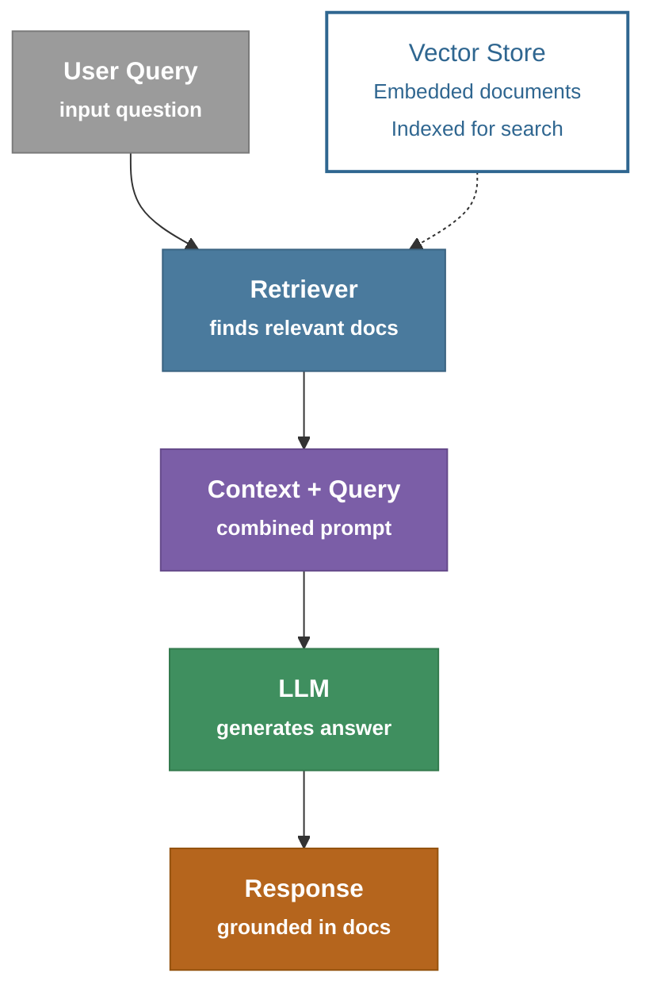
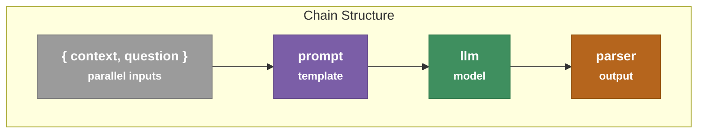
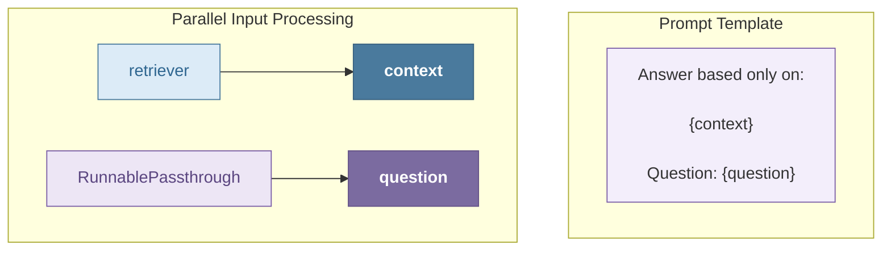
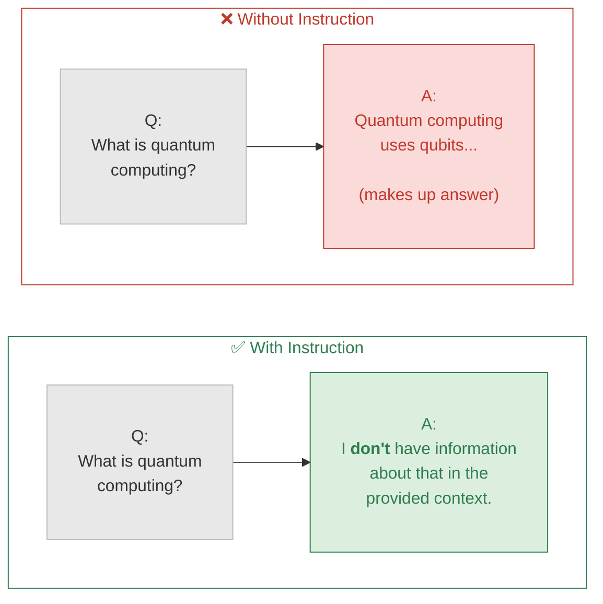
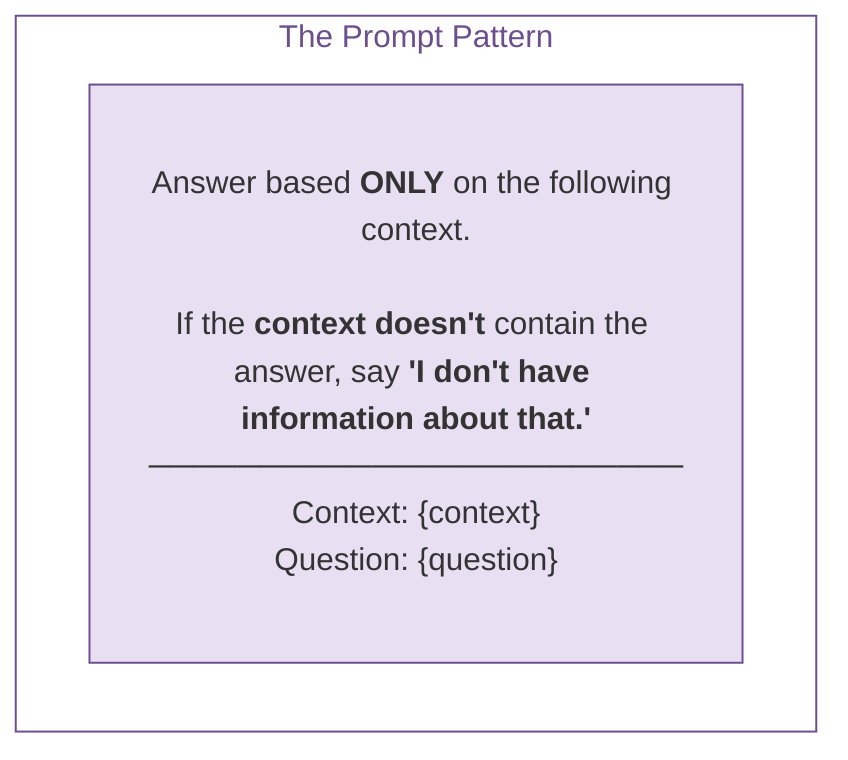
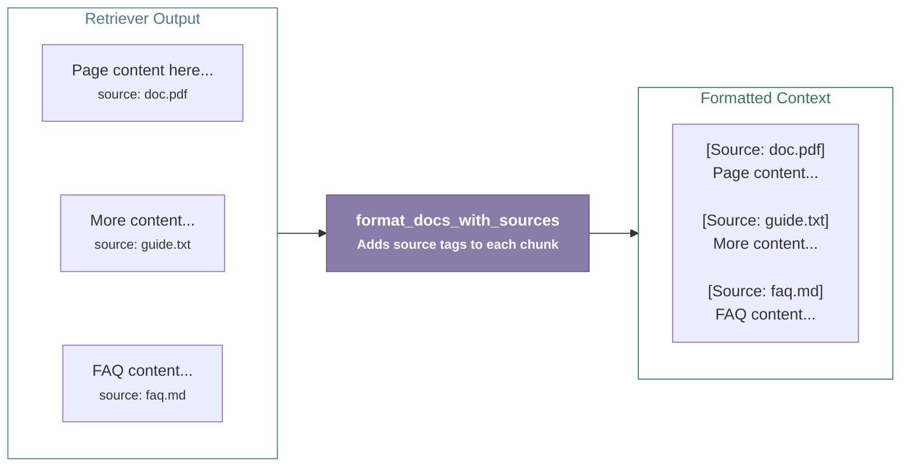

# RAG and Memory

## RAG Architecture



> **Key Concept:** RAG grounds LLM responses in actual documents, reducing hallucination.

> The flow: `User Query → Retriever → Context + Query → LLM → Response`, with the **Retriever** pulling from a **Vector Store** of embedded, indexed documents on the side.

---

## Basic RAG Chain

**Diagram 1 – Chain Structure**


**Diagram 2 – Prompt Template & Parallel Input Processing**


**Notes from the diagram:**
- `context` pulls from the **retriever**, while `question` passes straight through via **RunnablePassthrough** ("Question passes through unchanged").
- The prompt template combines them: *"Answer based only on: {context} — Question: {question}"*.
- Overall chain: `{context, question} → prompt → llm → parser`.

---

## Handling "I Don't Know"






> **Summary:** Without an explicit instruction, the LLM hallucinates an answer even when it lacks the information. Adding an instruction to the prompt ("say *I don't have information about that*") makes the model admit uncertainty instead of fabricating a response. This is achieved through a prompt pattern that constrains the answer strictly to the given context.

---

## RAG with Sources





> **Summary:** The `retriever` returns raw document chunks, each tagged with its source. The `format_docs_with_sources` function processes these chunks and attaches a `[Source: ...]` tag to each one, producing a formatted context block that preserves traceability back to the original documents.

> Users can verify answers.  Enable citation in responses. Builds trust. 使用者可驗證回答來源，並在回應中顯示引用（Citation），提升答案的可信度。

```python
  rag_chain = (
    {
      "context": retriever | format_docs_with_sources,
      "question": RunnablePassthrough(),
    }
    | prompt
    | llm
    | StrOutputParser()
  )
```
---

## Hands on Basic RAG

```bash
source .venv/Scripts/activate
cd langchain-course/

pyenv global 3.12.10
pyenv local 3.12.10

uv run rag_pipeline.py
```
