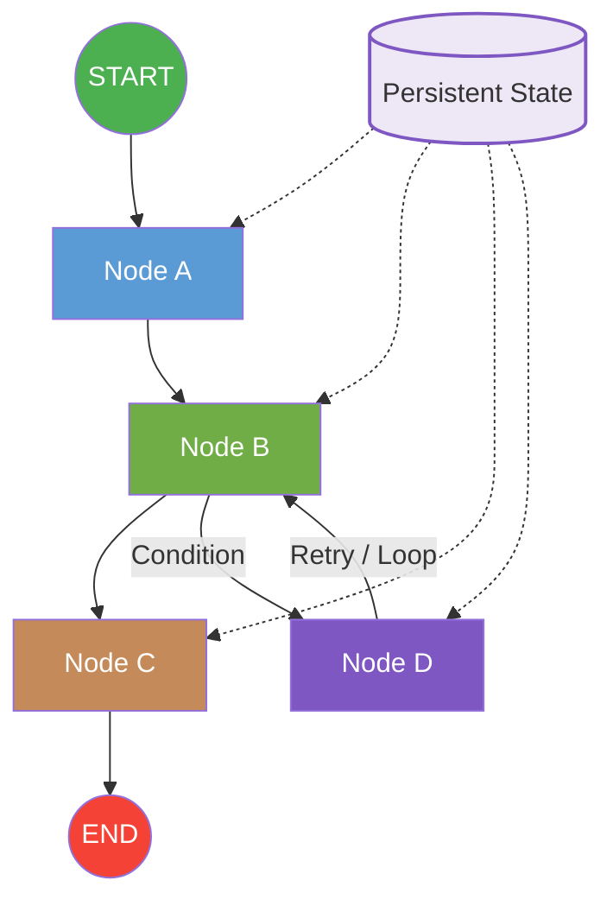
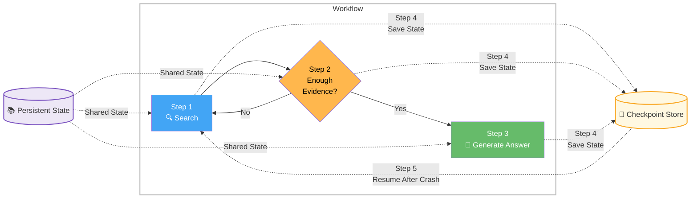
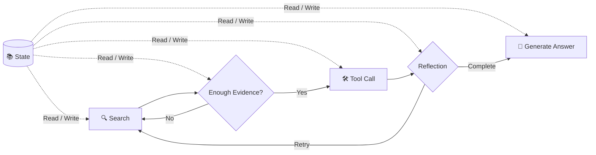
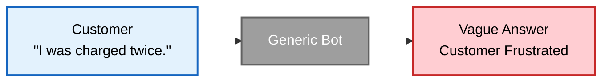
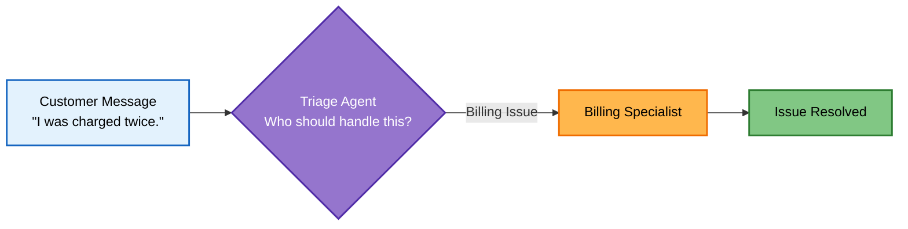
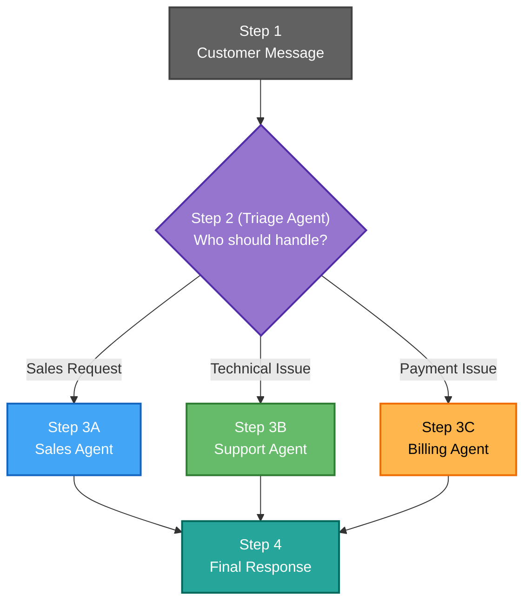
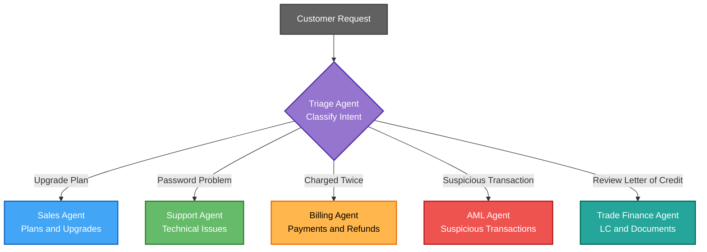
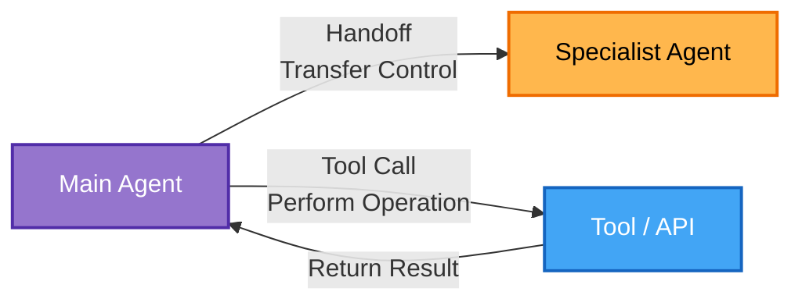

# LangGraph

## LangGraph Solution



## LangGraph Core capabilities

| Feature                   | What it means                                                                         | Example                                                                                                                      |
| ------------------------- | ------------------------------------------------------------------------------------- | ---------------------------------------------------------------------------------------------------------------------------- |
| ✅ **Cycles and Loops**    | A workflow can revisit previous nodes until a condition is satisfied.                 | An agent keeps searching and refining an answer until it finds enough evidence.                                              |
| ✅ **Persistent State**    | Shared state (memory) is maintained across all nodes throughout execution.            | User profile, chat history, retrieved documents, and intermediate results are available to every node.                       |
| ✅ **Conditional Routing** | The next node is selected dynamically based on the current state or LLM output.       | If confidence > 90%, return the answer; otherwise, perform another search or ask the user for clarification.                 |
| ✅ **Crash Recovery**      | Execution can resume from the last saved checkpoint after an interruption or failure. | If the server crashes during a 20-minute research task, the agent resumes from the last checkpoint instead of starting over. |

### Example in a RAG Agent

| Step                                 | LangGraph Feature   |
| ------------------------------------ | ------------------- |
| Retrieve documents                   | Persistent State    |
| Not enough evidence? Search again    | Cycles and Loops    |
| Choose Search / Summarize / Ask User | Conditional Routing |
| Server restarts during execution     | Crash Recovery      |

### Why this matters

Traditional **LangChain Chains** are generally:

```
A → B → C → End
```

LangGraph enables:



## When to use LangGraph

| Use LangChain When | Use LangGraph When |
|--------------------|--------------------|
| Simple chains | Stateful workflows |
| One-shot Q&A | Multi-turn agents |
| RAG pipelines | Self-correcting loops |
| No loops needed | Human-in-the-loop |
| Prototype phase | Production agents |

### Rule of Thumb

| If your application...                                    | Choose        |
| --------------------------------------------------------- | ------------- |
| Is a **linear** pipeline with no branching                    | **LangChain** |
| Requires **agentic workflows** with loops, memory, or conditional routing            | **LangGraph** |
| Needs **human approval** during execution                     | **LangGraph** |
| Is a simple chatbot or RAG demo                           | **LangChain** |
| Is a **production** AI agent with **multiple tools** and recovery | **LangGraph** |

> Simple guideline: LangChain is ideal for **linear** LLM applications, while LangGraph is designed for **stateful**, **agentic workflows** with loops, memory, conditional routing, and resilience.

---

## LangGraph Real-World Use Cases

| Use Case | Description |
|----------|-------------|
| **Customer Support Bot** | Handles customer tickets, escalates complex issues, and follows up with users. |
| **Research Agent** | Searches, evaluates, and iterates until sufficient evidence is found. |
| **Code Review** | Analyzes code, suggests improvements, and re-checks after changes. |
| **Approval Workflows** | Supports multi-day business processes with human review and approval. |

---

### LangGraph Features Used
| Use Case             | Persistent State |   Loops  | Conditional Routing | Human-in-the-loop |
| -------------------- | :--------------: | :------: | :-----------------: | :---------------: |
| Customer Support Bot |         ✅        |     ✅    |          ✅          |         ✅         |
| Research Agent       |         ✅        |     ✅    |          ✅          |         ❌         |
| Code Review          |         ✅        |     ✅    |          ✅          |      Optional     |
| Approval Workflows   |         ✅        | Optional |          ✅          |         ✅         |

---

> Here is the Markdown version of the slide:

```markdown
# Real-World Use Cases

| Use Case | Description |
|----------|-------------|
| **Customer Support Bot** | Handles customer tickets, escalates complex issues, and follows up with users. |
| **Research Agent** | Searches, evaluates, and iterates until sufficient evidence is found. |
| **Code Review** | Analyzes code, suggests improvements, and re-checks after changes. |
| **Approval Workflows** | Supports multi-day business processes with human review and approval. |
```

## Brief Explanation

| Use Case                 | Why LangGraph Fits                                                                                                         |
| ------------------------ | -------------------------------------------------------------------------------------------------------------------------- |
| **Customer Support Bot** | Maintains conversation history, routes requests, escalates to humans, and follows up automatically.                        |
| **Research Agent**       | Performs iterative searches, evaluates results, retries when needed, and stops only when sufficient evidence is collected. |
| **Code Review**          | Reviews code, suggests fixes, waits for updates, and re-runs analysis until quality criteria are met.                      |
| **Approval Workflows**   | Pauses execution for human approval, resumes later, and supports long-running business processes.                          |

## LangGraph Features Used

| Use Case             | Persistent State |   Loops  | Conditional Routing | Human-in-the-loop |
| -------------------- | :--------------: | :------: | :-----------------: | :---------------: |
| Customer Support Bot |         ✅        |     ✅    |          ✅          |         ✅         |
| Research Agent       |         ✅        |     ✅    |          ✅          |         ❌         |
| Code Review          |         ✅        |     ✅    |          ✅          |      Optional     |
| Approval Workflows   |         ✅        | Optional |          ✅          |         ✅         |

---

> **Key takeaway:** These use cases all involve more than a simple request-response interaction. They require **memory, iteration, decision-making, and often human intervention**, making them ideal candidates for **LangGraph** rather than a linear LangChain workflow.

---

## LangGraph 1.0 Highlights

| #     | Feature                  | Description                                                                                 | Why It Matters                                                                                         |
| ----- | ------------------------ | ------------------------------------------------------------------------------------------- | ------------------------------------------------------------------------------------------------------ |
| **1** | **Durable State**        | Survives crashes and resumes execution from the last checkpoint.                            | Prevents losing progress during crashes or restarts, improving reliability for long-running workflows. |
| **2** | **Built-in Persistence** | Supports SQLite and PostgreSQL out of the box—no custom database code required.             | Reduces development effort while providing reliable, built-in state persistence.                       |
| **3** | **Human-in-the-Loop**    | Provides first-class interrupt and resume capabilities for human approval and intervention. | Enables safe collaboration between AI and humans for critical decisions and approvals.                 |
| **4** | **Production-Ready**     | Used in production by companies such as Uber, LinkedIn, and Klarna.                         | Delivers enterprise-grade reliability, scalability, and fault tolerance for production AI agents.      |


## Key Takeaway

> **LangGraph 1.0** is designed for **production AI agents**, offering:
>
> * ✅ Durable execution with automatic checkpointing
> * ✅ Built-in persistence (SQLite, PostgreSQL, etc.)
> * ✅ Human-in-the-loop workflows
> * ✅ Enterprise-ready reliability for long-running agent applications

---

## The Three Pilars


| #     | Pillar    | Description                                                        | LangGraph Example                                                     | Real-World Analogy                                                                                                                     |
| ----- | --------- | ------------------------------------------------------------------ | --------------------------------------------------------------------- | -------------------------------------------------------------------------------------------------------------------------------------- |
| **1** | **State** | **What the agent knows and tracks** throughout execution.          | Chat history, user profile, retrieved documents, intermediate results | A patient's medical record that stores all relevant information.                                                                       |
| **2** | **Node**  | **Functions that process the state** by performing specific tasks. | Search documents, call GPT-5, execute a Python tool, summarize text   | A doctor examining the patient, making decisions, and updating the medical record.                                                     |
| **3** | **Edge**  | **Connections between nodes** that determine the execution flow.   | If confidence > 90%, generate the answer; otherwise, search again.    | The hospital workflow deciding whether the patient should receive treatment, undergo more tests, or be referred to another department. |

### Easy to Remember

| Pillar    | One Sentence                     |
| --------- | -------------------------------- |
| **State** | **Stores** what the agent knows. |
| **Node**  | **Processes** the information.   |
| **Edge**  | **Controls** what happens next.  |

> **Memory aid:**
> **State = Data**, **Node = Action**, **Edge = Flow**. These three pillars form the foundation of every LangGraph application.

---



| 元件        | 簡單理解                   | 更精確的說明                                                            |
| --------- | ---------------------- | ----------------------------------------------------------------- |
| **Edge**  | **箭頭**                 | 定義 **下一個要執行哪個 Node**，可以是一般流程（Normal Edge）或條件流程（Conditional Edge）。 |
| **Node**  | **Process（處理程序）**      | 一個執行單元（通常是一個 Python function），負責讀取 State、執行工作，並更新 State。          |
| **State** | **共用狀態（Shared State）** | 所有 Node 共用的資料，任何 Node 都可以讀取（Read）和更新（Write）。                      |

---

##　StateGraph Explained

| Step  | Action           | What You Do                       | LangGraph Pillar        | Result                                                               |
| ----- | ---------------- | --------------------------------- | ----------------------- | -------------------------------------------------------------------- |
| **1** | **Define State** | Design the shared data structure. | **State**               | Every node can read from and update the same shared state.           |
| **2** | **Create Graph** | Instantiate a `StateGraph`.       | **Graph Container**     | Creates an empty workflow that will hold nodes and edges.            |
| **3** | **Add Nodes**    | Register processing functions.    | **Nodes**               | Defines the processing logic and capabilities of the AI agent.       |
| **4** | **Add Edges**    | Connect the nodes.                | **Edges**               | Defines the execution flow, routing, and transitions between nodes.  |
| **5** | **Compile**      | Build the executable graph.       | **Executable Workflow** | Produces a runnable LangGraph application ready to process requests. |


| Step  | Keyword     | Meaning                        |
| ----- | ----------- | ------------------------------ |
| **1** | **State**   | Define the shared data.        |
| **2** | **Graph**   | Create the workflow container. |
| **3** | **Nodes**   | Add processing logic.          |
| **4** | **Edges**   | Connect the workflow.          |
| **5** | **Compile** | Build and run the AI agent.    |

---

## State Definition

In LangGraph, the **State** defines the shared data that all nodes can read and update. Each field can specify how its value is updated during workflow execution.

| State Type | Definition | Update Behavior | Example |
|------------|------------|-----------------|---------|
| **Simple Field** | ```python current_step: str``` | Replaced each time | `old → new` |
| **Annotated (`add_messages`)** | ```python messages: Annotated[list, add_messages]``` | Appends new messages to the existing list | `[a] + [b] → [a, b]` |
| **Annotated (`operator.add`)** | ```python token_count: Annotated[int, operator.add]``` | Accumulates numeric values by addition | `5 + 3 → 8` |

> **Rule of Thumb**
>
> - **Simple Field** → Replace the previous value.
> - **`add_messages`** → Keep all conversation messages.
> - **`operator.add`** → Accumulate numeric values.

---

## Nodes

> Nodes receive full state, return partial updates

### INPUT: Full State
```python
state["messages"]
state["step_count"]
state["current_step"]
```

### PROCESS
- Read state
- Do work (LLM call, etc.)
- Return updates

### OUTPUT: Partial
```python
return {
  "messages": [resp],
  "current_step": "done"
}
```
---

## Edges

### Direct Edge
A always goes to B

```
A → B
```

```python
graph.add_edge("A", "B")
```

### Conditional Edge
A goes to B or C based on logic

```
A → B ?
A → C ?
```

```python
graph.add_conditional_edges(
  "A", routing_fn,
  {"route_b": "B", "route_c": "C"}
)
```

> routing_fn itself contains the conditional logic

## Hands on LangGraph

```bash
source .venv/Scripts/activate
cd langchain-course/

pyenv global 3.12.10
pyenv local 3.12.10

uv run langgraph_core.py
```

## Why Handoffs?

### What Is a Handoff?

A **handoff** transfers control of a request from one AI agent to another agent with more appropriate expertise.

Instead of requiring one general-purpose agent to handle every request, a **Triage Agent** analyzes the user's intent and delegates the task to a suitable specialist.

---

> The Real-World Problem *"Every company with a chatbot hits the same wall — one agent can't do everything."*

### Problem vs. Solution

| Problem | Solution |
|---|---|
| **Customer:** “I was charged twice.” | **Triage Agent → Billing Specialist** |
| A generic bot provides a vague answer, leaving the customer frustrated. | The request is routed to the appropriate specialist for faster and more accurate resolution. |

---

### The Problem: Generic Bot



---

### The Solution: Agent Handoff



---

### Multi-Agent Handoff Flow



---

### Why Use Handoffs?

| Benefit | Description | Example |
|---|---|---|
| **Specialization** | Each agent focuses on a specific domain. | The Billing Agent handles invoices and payments. |
| **Better Accuracy** | A domain-specific agent can provide more precise answers. | The Support Agent diagnoses technical problems. |
| **Scalability** | New specialist agents can be added without redesigning the entire system. | Add AML or Trade Finance agents. |
| **Maintainability** | Each agent maintains its own prompts, tools, and business rules. | Update the Billing Agent without affecting Sales. |

---

### Enterprise Handoff Example



---

### Furthermore - Handoff vs. Tool Call

| Handoff | Tool Call |
|---|---|
| Transfers control to another **AI agent**. | Invokes a **function, API, database, or external service**. |
| The specialist agent continues using its own prompt, tools, and expertise. | The same agent normally retains control after receiving the tool result. |
| Best suited to specialized reasoning and responsibility. | Best suited to performing a specific operation. |



> **Rule of thumb**
>
> - **Tool Call** = Ask a tool to perform a specific operation.
> - **Handoff** = Transfer the request to another specialist AI agent.


## Hands on Handsoff

```bash
uv run agent_handoffs.py
uv run agent_conversation.py
```
