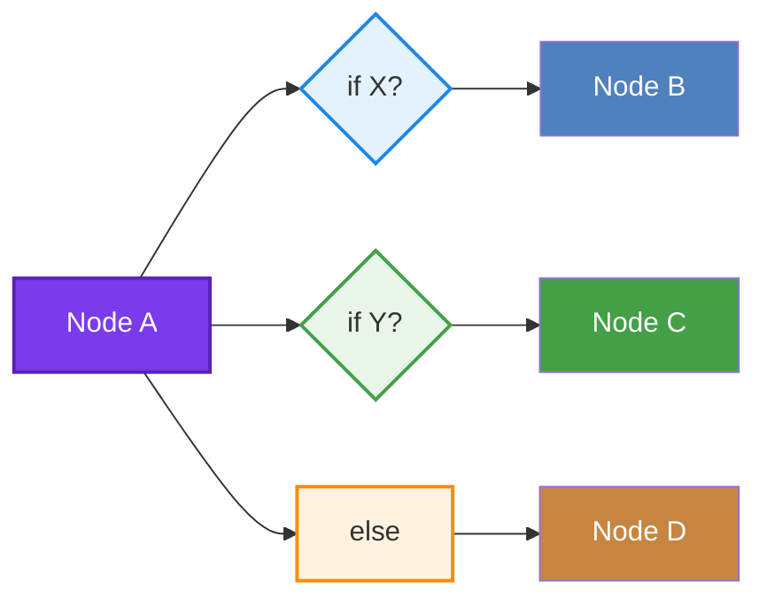
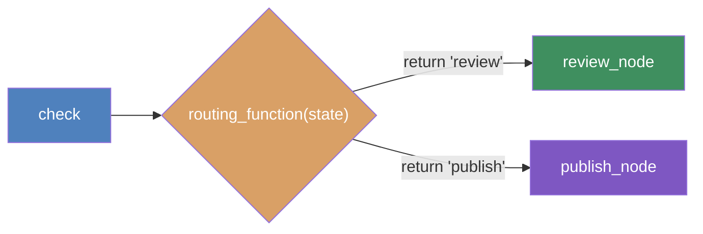
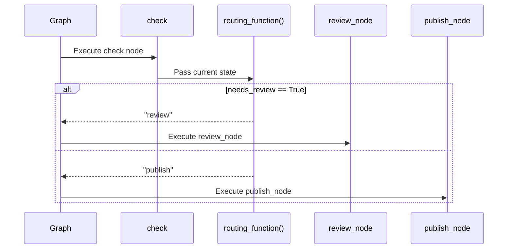
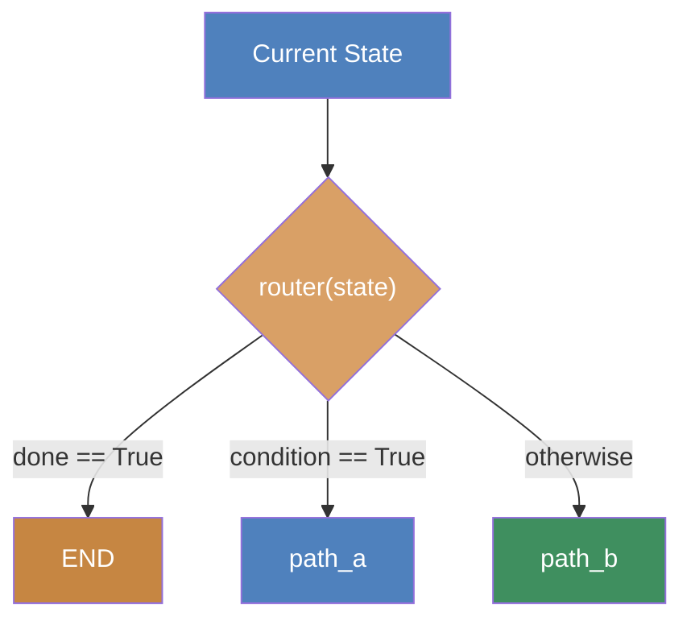
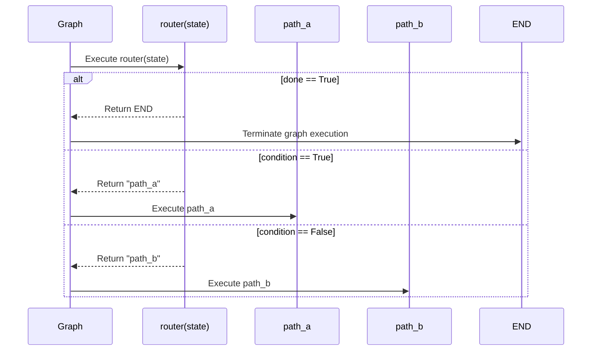
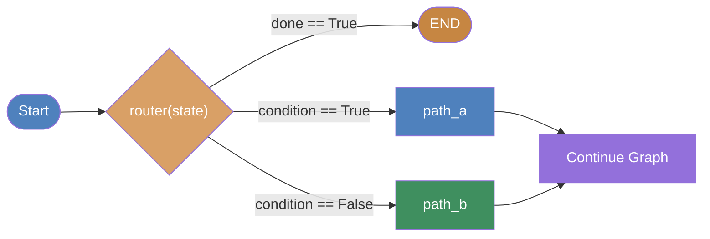
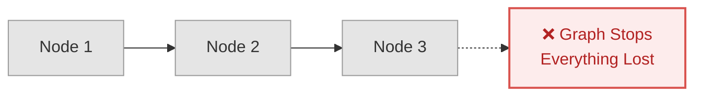
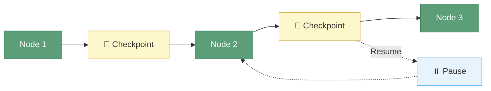
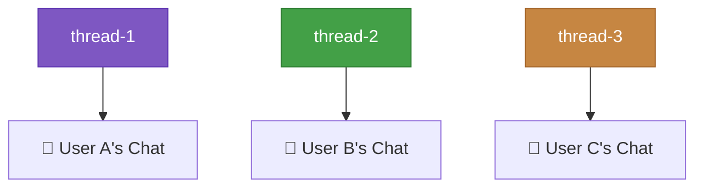
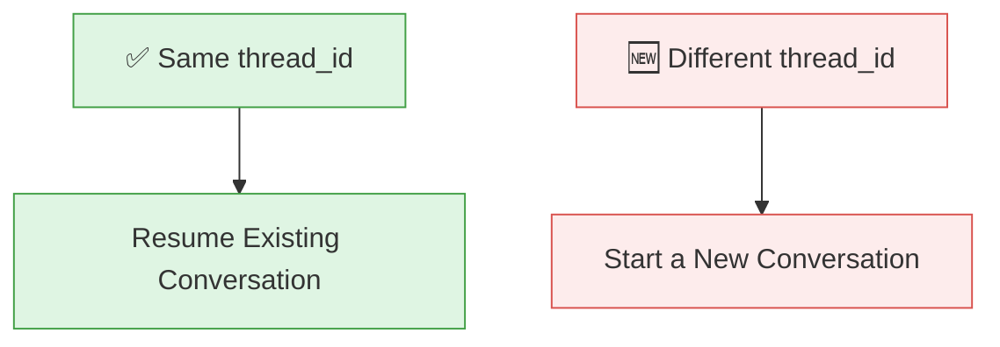

# LangGraph 常見 State 一覽

**State 是 Workflow 的資料模型，下面列出實務上最常見的 State，以及企業 AI Agent 最常使用的情境。

| State        | 資料型態 | 用途                  | 真實案例           |
| ------------ | -------- | --------------------- | ------------------ |
| messages     | list     | 對話歷史              | Chatbot            |
| current_step | str      | 目前流程              | Workflow           |
| next_step    | str      | 下一步                | Routing            |
| user_input   | str      | 使用者問題            | Chat               |
| intent       | str      | Intent Classification | 客服               |
| entities     | dict     | NER結果               | Trade Finance      |
| documents    | list     | Retriever結果         | RAG                |
| context      | str      | Prompt Context        | QA                 |
| answer       | str      | LLM回答               | Chat               |
| tool_calls   | list     | Tool紀錄              | ReAct Agent        |
| tool_result  | Any      | Tool輸出              | API                |
| memory       | dict     | 長期記憶              | Personal Assistant |
| session_id   | str      | Session識別           | Multi-user         |
| retry_count  | int      | Retry次數             | Error Recovery     |
| error        | str      | Error訊息             | Exception          |
| confidence   | float    | 信心分數              | AI Review          |
| feedback     | str      | User Feedback         | RLHF               |
| metadata     | dict     | 額外資訊              | Audit              |
| status       | str      | 執行狀態              | BPM                |
| checkpoint   | dict     | Recovery資訊          | Resume             |

---

# 1. messages

最常見。

```python
messages: Annotated[list, add_messages]
```

用途

```
Human
 ↓
AI
 ↓
Tool
 ↓
AI
```

每一步都加入 messages。

例如

```
User:
How many employees?

AI:
Searching...

Tool:
Employee API

AI:
There are 120 employees.
```

messages 會一直累積。

適合：

* Chatbot
* Agent
* Copilot

---

# 2. current_step

代表 Workflow 執行到哪。

例如

```
Receive Question↓Search KB↓Call API↓Generate Answer↓Finish
```

State

```python
current_step="Search KB"
```

真實案例：

Trade Finance

```
LC Issue↓Compliance↓Accounting↓SWIFT↓Complete
```

---

# 3. next_step

通常搭配 Conditional Edge。

例如

```python
next_step="Need Approval"
```

Graph

```
if amount>100000↓Approval

else↓Payment
```

---

# 4. user_input

保留原始問題。

例如

```python
user_input="How many unpaid invoices?"
```

方便：

* Retry
* Logging
* Audit

---

# 5. intent

LLM 做 Intent Classification。

例如

```
Question↓Intent↓FAQ↓Payment↓Transfer↓Complaint
```

State

```python
intent="Transfer Money"
```

銀行客服大量使用。

---

# 6. entities

NER 抽取結果。

例如

```
Transfer 100 USD
to Tom
tomorrow
```

變成

```python
entities={
    "amount":100,
    "currency":"USD",
    "receiver":"Tom",
    "date":"Tomorrow"
}
```

Trade Finance

```
LC Number
Applicant
Beneficiary
Expiry
Currency
```

全部存在 entities。

---

# 7. documents

Retriever 找回文件。

例如

```python
documents=[
    doc1,
    doc2,
    doc3
]
```

適合

* RAG
* FAQ
* Enterprise Search

---

# 8. context

把 documents 整理後放進 Prompt。

例如

```
Retriever↓5 docs
↓
Compression
↓
Context
↓
LLM
```

State

```python
context="Customer A opened LC..."
```

---

# 9. answer

最後答案。

```python
answer="The LC has expired."
```

通常最後 UI 顯示。

---

# 10. tool_calls

ReAct Agent 常見。

例如

```
Search
Calculator
SQL
Weather
```

紀錄：

```python
tool_calls=[
   "Search",
   "Calculator"
]
```

方便 Debug。

---

# 11. tool_result

Tool 回傳資料。

例如

```python
tool_result={
    "balance":5000
}
```

下一個 Node 使用。

---

# 12. memory

長期記憶。

例如

```python
memory={
   "favorite_language":"Python"
}
```

Personal AI
CRM
Copilot
都常見。

---

# 13. session_id

多人聊天。

例如

```python
session_id="abc123"
```

對應 SQLite、
Redis、
Postgres Memory。

---

# 14. retry_count

例如

```
API Timeout
Retry 1
Retry 2
Retry 3
```

State

```python
retry_count=2
```

---

# 15. error

例如

```python
error="Timeout"
```

Error Node 可以決定：

```
Retry↓Fallback↓Human Review
```

---

# 16. confidence

AI 信心值。

例如

```python
confidence=0.62
```

如果

```
confidence<0.7
```

則

```
Human Review
```

---

# 17. feedback

例如

```
👍

👎

Wrong Answer
```

State

```python
feedback="Wrong amount"
```

後續可重新訓練。

---

# 18. metadata

放任何額外資訊。

例如

```python
metadata={
    "user":"Chris",
    "time":"10:30",
    "channel":"Web"
}
```

Audit 非常常見。

---

# 19. status

Workflow 狀態。

例如

```
Pending
Running
Completed
Cancelled
Failed
```

State

```python
status="Running"
```

---

# 20. checkpoint

LangGraph 最大特色之一。

例如

```
Node1↓Node2↓Crash↓Resume
```

Checkpoint

```python
checkpoint={
    "current_node":"Node2"
}
```

可以從 Node2 繼續。

---

# 企業 AI Agent（推薦 State 設計）

以下是一個適合 **LangGraph + RAG + MCP + BPMN 2.0 + Trade Finance** 的完整 Shared State 設計：

```python
class AgentState(TypedDict):
    # Conversation
    messages: Annotated[list, add_messages]
    user_input: str
    answer: str

    # Workflow
    current_step: str
    next_step: str
    status: str

    # AI
    intent: str
    entities: dict
    confidence: float

    # RAG
    documents: list
    context: str

    # Tool / MCP
    tool_calls: list
    tool_result: dict

    # Memory
    session_id: str
    memory: dict

    # Error Handling
    retry_count: int
    error: str

    # Human-in-the-loop
    feedback: str

    # Audit
    metadata: dict

    # Recovery
    checkpoint: dict
```

## 不同應用場景的建議 State 組合

| 應用場景                                            | 建議 State                                                                                           |
| --------------------------------------------------- | ---------------------------------------------------------------------------------------------------- |
| **Chatbot**                                   | `messages`, `user_input`, `answer`, `session_id`                                             |
| **RAG 問答**                                  | `messages`, `documents`, `context`, `answer`, `confidence`                                 |
| **ReAct Agent / MCP Agent**                   | `messages`, `tool_calls`, `tool_result`, `current_step`, `status`                          |
| **BPMN + LangGraph**                          | `current_step`, `next_step`, `status`, `retry_count`, `error`, `checkpoint`              |
| **Trade Finance（LC/Guarantee/Collections）** | `intent`, `entities`, `documents`, `tool_result`, `current_step`, `status`, `metadata` |
| **Multi-Agent 系統**                          | `messages`, `current_step`, `next_step`, `memory`, `session_id`, `metadata`              |
| **Human-in-the-Loop**                         | `confidence`, `feedback`, `status`, `error`, `checkpoint`                                  |

> **最佳實務：** 不要把所有欄位都放進 State。應根據業務場景設計一個精簡且共享的 State Schema。State 應保存工作流程需要共享的資訊，而大型文件、二進位資料或可重新取得的資料則應保存在外部（例如資料庫、向量資料庫或物件儲存），State 中只保留必要的引用或摘要。

---

## Edges

### Direct Edge

A always goes to B

A → B

```python
graph.add_edge("A", "B")
```

### Conditional Edge

A goes to B or C based on logic in **routing_fn**

A → **routing_fn** -> B or C (based on logic)

```python
graph.add_conditional_edges(
    "A", routing_fn,
    {"route_b": "B", "route_c": "C"}
)
```

### With Conditions

**Dynamic routing** based on **state**



## LangGraph `add_conditional_edges()` Syntax

`add_conditional_edges()` allows a node to dynamically route to different next nodes based on the current state.

---

### 1. Define a Routing Function

The routing function examines the graph state and returns the **name (key)** of the next node.

```python
def routing_function(state):
    if state["needs_review"]:
        return "review"
    else:
        return "publish"
```

> **Return value:** A routing key (e.g., `"review"` or `"publish"`)

---

### 2. Add Conditional Edges

Associate the routing keys returned by the routing function with actual graph nodes.

```python
graph.add_conditional_edges(
    "check",                # Source node
    routing_function,       # Router function
    {
        "review": "review_node",
        "publish": "publish_node"
    }
)
```

### Parameters

| Parameter            | Description                            |
| -------------------- | -------------------------------------- |
| `"check"`          | Source node where routing begins       |
| `routing_function` | Function that determines the next path |
| Dictionary           | Maps routing keys to destination nodes |

---

### Execution Flow



---

### Runtime Decision Process



---

## Using Literal Types in LangGraph

`Literal` type hints make routing **explicit**, **type-safe**, and **IDE-friendly**.

---

### Router with Literal Return Type

```python
from typing import Literal
from langgraph.graph import END

def router(state: State) -> Literal["path_a", "path_b", END]:
    if state["done"]:
        return END
    elif state["condition"]:
        return "path_a"
    else:
        return "path_b"
```

### Why Use `Literal`?

- Clearly specifies all possible return values.
- Enables IDE auto-completion and static type checking.
- Prevents accidental routing to invalid node names.
- Makes graph routing easier to understand and maintain.

---

### Possible Outputs

| Return Value | Condition              | Result              |
| ------------ | ---------------------- | ------------------- |
| `"path_a"` | `condition == True`  | Route to`path_a`  |
| `"path_b"` | `condition == False` | Route to`path_b`  |
| `END`      | `done == True`       | Terminate the graph |

> `END` is a special LangGraph constant that ends workflow execution.

---

### Routing Logic



---

### Runtime Flow



---

### Complete Flow



---

### Summary

| Component         | Purpose                                               |
| ----------------- | ----------------------------------------------------- |
| `Literal[...]`  | Restricts the router's return values to valid options |
| `router(state)` | Determines the next execution path                    |
| `"path_a"`      | Route to`path_a` node                               |
| `"path_b"`      | Route to`path_b` node                               |
| `END`           | Stop graph execution                                  |

---

### Benefits of Using `Literal`

- ✅ Compile-time type checking
- ✅ IDE auto-completion
- ✅ Prevents invalid routing names
- ✅ Self-documenting router functions
- ✅ Easier to maintain large LangGraph workflows

> This pattern is recommended for production LangGraph applications because it makes routing explicit, type-safe, and easier to understand.

---

## Hands on Literal Routing Types

```bash
uv run conditional_edges.py
uv run cycles_loops.py
```

## Human-in-the-Loop (HITL): The Big Idea

> Sometimes you **need a human to say "yes" or "no" before the agent continues.**

## Example: Email Assistant


### The Challenge

> Cycles, loops, conditional routing — the agent decided everything. But production needs human checkpoints.


### Why Human-in-the-Loop?

Even though AI agents can support:

- Cycles
- Loops
- Conditional routing
- Autonomous decision making

Production systems often require **human checkpoints** before executing high-impact actions such as:

- Sending emails
- Approving payments
- Executing trades
- Deploying production systems
- Signing contracts

This ensures:
- ✅ Human oversight
- ✅ Compliance
- ✅ Risk reduction
- ✅ Accountability

---

## Prerequsite #1 MemorySaver (Checkpointer)

> 🎮 **Like a SAVE POINT in a video game**

### Without Checkpointer



**Result**

- No checkpoint is saved.
- If the graph stops or crashes, all progress is lost.
- Execution must restart from **Node 1**.

---

### With Checkpointer



**Result**

- State is saved after each checkpoint.
- The graph can pause safely.
- Execution resumes exactly where it left off.
- No need to restart from the beginning.

---

### LangGraph Usage

```python
from langgraph.checkpoint.memory import MemorySaver

memory = MemorySaver()

app = graph.compile(
    checkpointer=memory
)
```

---

### Why Use a Checkpointer?

A checkpointer enables LangGraph to:

- ✅ Pause and resume execution
- ✅ Support Human-in-the-Loop (HITL)
- ✅ Recover from failures or crashes
- ✅ Persist graph state
- ✅ Resume long-running workflows
- ✅ Maintain conversation history across graph executions

---


## Prerequisite #2 thread_id (Conversation ID)

> 🎮 **Like a SAVE SLOT in a video game**

### Concept

A **thread_id** uniquely identifies a conversation (or workflow execution).

- Each **thread_id** has its own conversation history and checkpoint state.
- Different **thread_id** values represent different conversations.
- Reusing the same **thread_id** resumes the existing conversation.

---

### Different `thread_id` = Different Conversations



Each conversation maintains its own:

- Messages
- State
- Checkpoints
- Execution progress

---

### Key Concept



---

### Example

```python
config = {
    "configurable": {
        "thread_id": "demo-1"
    }
}

app.invoke(
    {"messages": [...]},
    config=config
)
```

Later...

```python
config = {
    "configurable": {
        "thread_id": "demo-1"
    }
}

# Resume the same conversation
app.invoke(
    {"messages": [...]},
    config=config
)
```

Start a brand-new conversation:

```python
config = {
    "configurable": {
        "thread_id": "demo-2"
    }
}
```

---

### Relationship Between `thread_id` and Checkpointer

```text
MemorySaver (Checkpointer)
        │
        ▼
+------------------------------+
| thread-1                     |
|  ├─ Messages                 |
|  ├─ State                    |
|  └─ Checkpoints              |
+------------------------------+

+------------------------------+
| thread-2                     |
|  ├─ Messages                 |
|  ├─ State                    |
|  └─ Checkpoints              |
+------------------------------+

+------------------------------+
| thread-3                     |
|  ├─ Messages                 |
|  ├─ State                    |
|  └─ Checkpoints              |
+------------------------------+
```

Each **thread_id** has its own isolated checkpoint history.

---

### Video Game Analogy

```text
Checkpoint = SAVE SYSTEM
thread_id  = SAVE SLOT

MemorySaver
├── Save Slot 1 (thread-1)
├── Save Slot 2 (thread-2)
└── Save Slot 3 (thread-3)
```

- **MemorySaver** is the save system.
- **thread_id** is the save slot.
- Reusing the same save slot resumes where you left off.
- Creating a new save slot starts a completely new game.

---

### Summary

| Component | Purpose |
|-----------|---------|
| **MemorySaver** | Stores checkpoints and graph state |
| **thread_id** | Identifies a specific conversation or workflow |
| Same `thread_id` | Resume an existing conversation |
| Different `thread_id` | Start a new conversation |
| Analogy | MemorySaver = Save System, thread_id = Save Slot |
````
