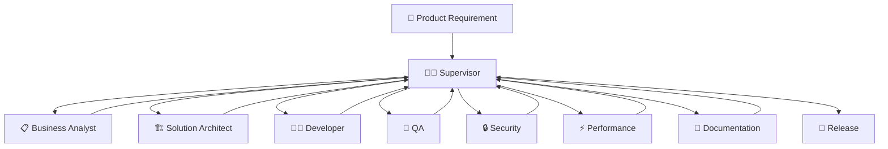
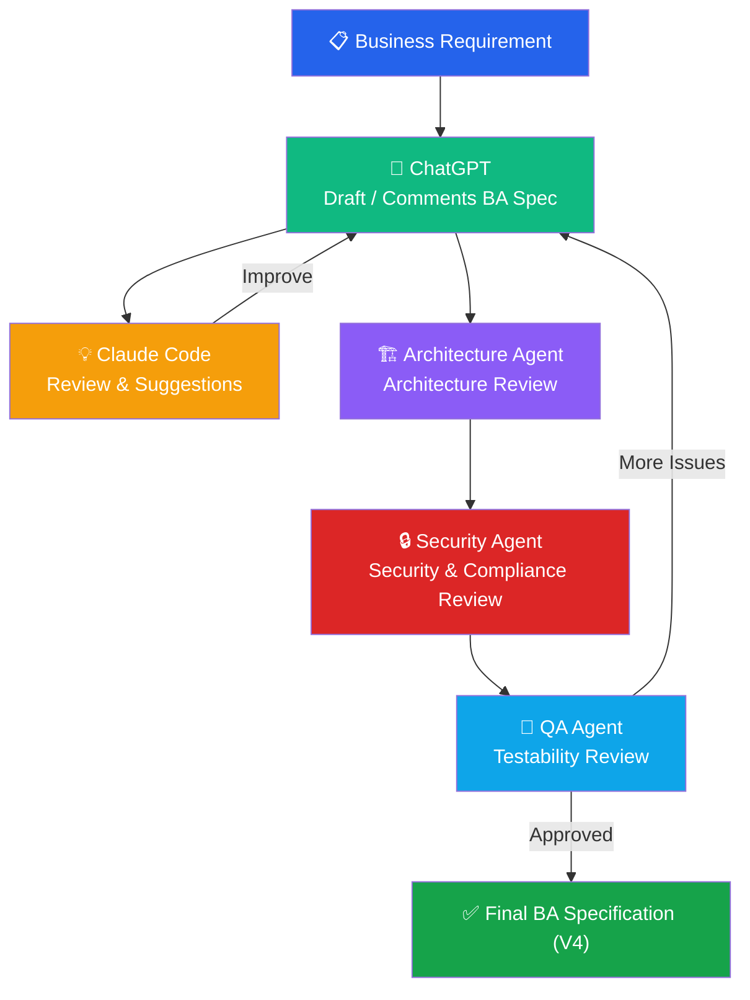
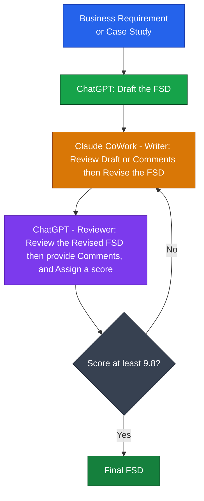

當然，而且**軟體開發（Software Development）其實是 LangGraph Multi-Agent 最典型、最成熟的應用場景之一**。像 **Claude Code、OpenAI Codex、GitHub Copilot Workspace、Google Jules、Devin** 等，都大量運用了 Multi-Agent 的概念。

以下是可以放在教材中的內容。

---

## LangGraph 在軟體開發中的應用

LangGraph 在軟體開發領域具有顯著優勢，它能夠將不同專業能力拆分為多個 AI Agent，並透過 **Supervisor、Handoff、Shared State** 等機制協同完成複雜的軟體開發工作。

例如，一個需求從分析到交付，可以由多個專業 Agent 共同完成：

| Agent                        | Responsibility                          |
| ---------------------------- | --------------------------------------- |
| 📋 Business Analyst Agent    | 分析需求、撰寫 Business Analysis Specification |
| 🏗️ Solution Architect Agent | 設計系統架構、API 與資料模型                        |
| 👨‍💻 Developer Agent        | 撰寫程式碼、重構與實作功能                           |
| 🧪 QA Agent                  | 產生測試案例、執行測試、驗證需求                        |
| 🔒 Security Agent            | 檢查安全漏洞（OWASP、SQL Injection、XSS 等）       |
| ⚡ Performance Agent          | 分析效能、提出最佳化建議                            |
| 📝 Documentation Agent       | 更新 API 文件、使用手冊與 Release Notes           |

---

## Multi-Agent Collaboration



---

## Shared State（LangGraph）

所有 Agent 可以共用同一份 State，例如：

```python
class SoftwareProjectState(TypedDict):

    requirement: str

    architecture: str

    source_code: str

    unit_tests: list

    review_comments: list

    vulnerabilities: list

    performance_report: str

    documentation: str

    status: str
```

每個 Agent 只負責更新自己擁有的欄位：

* BA Agent → `requirement`
* Architect Agent → `architecture`
* Developer Agent → `source_code`
* QA Agent → `unit_tests`
* Security Agent → `vulnerabilities`
* Performance Agent → `performance_report`
* Documentation Agent → `documentation`

這就是 **Shared State Pattern**。

---

## 真實案例：Business Analysis Specification

這也正好符合你之前提到的工作流程：



在這個流程中：

* **ChatGPT**：撰寫 Business Analysis Specification。
* **Claude Code**：Review、找出缺漏與改善建議。
* **Architecture Agent**：檢查系統架構是否合理。
* **Security Agent**：檢查安全性與合規性。
* **QA Agent**：確認需求是否可測試、是否完整。

所有 Agent 都透過 LangGraph 的 **Shared State** 持續更新同一份 BA 文件，最終產出高品質的 V4 規格。

符合 LangGraph 的設計理念：

* Cycle（循環）：ChatGPT ⇄ Claude Code 持續迭代改善規格。
* Conditional Edge（條件路由）：QA 若發現問題，回到 ChatGPT 修正；若通過，則完成文件。
* Multi-Agent Collaboration（多 Agent 協作）：Architecture、Security、QA 等專業 Agent 各自負責 Review 自己的領域。
* Business Outcome：最終產出高品質的 BA Specification V4，而不是一次完成的 V1。這也是企業實際撰寫需求規格、設計文件與程式碼時最常見的工作模式。

## Funtional Spec.


---

## 為什麼 LangGraph 特別適合軟體開發？

| LangGraph 能力                 | 軟體開發價值                                     |
| ---------------------------- | ------------------------------------------ |
| **State Management**         | 所有 Agent 共用同一份專案狀態（需求、設計、程式碼、測試、文件）。       |
| **Reducer**                  | 安全地合併多位 Agent 的 Review Comments、測試結果、分析報告。 |
| **Conditional Edge**         | 根據 Review 結果決定是否回到 Developer 修正，形成迭代流程。    |
| **Cycles**                   | 支援「開發 → Review → 修正 → 再 Review」的持續迭代。      |
| **Handoff**                  | 自動將工作交給最適合的專業 Agent，例如 Security 或 QA。      |
| **Supervisor Pattern**       | 統一協調需求分析、設計、開發、測試與文件產出。                    |
| **Checkpoint / Persistence** | 保存整個開發流程狀態，支援中斷後恢復與長時間任務。                  |

### 總結

LangGraph 的價值不只是「讓多個 AI 一起工作」，而是提供了 **State、Graph、Reducer、Handoff、Supervisor、Checkpoint** 等核心能力，讓 AI Agent 能像一個真正的軟體開發團隊一樣協作，從需求分析、架構設計、程式開發、程式碼審查、測試到文件撰寫，形成可持續迭代、可追蹤、可恢復的完整開發流程。這也是為什麼 LangGraph 特別適合企業級軟體工程與 Agentic AI 應用。
