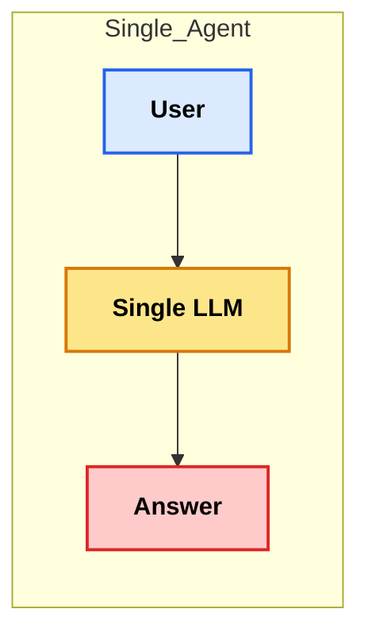
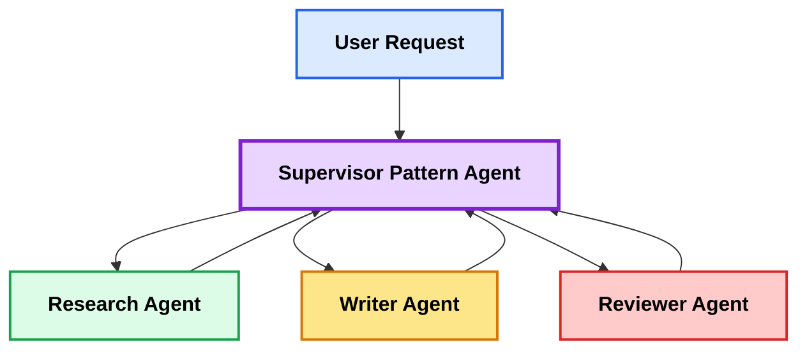
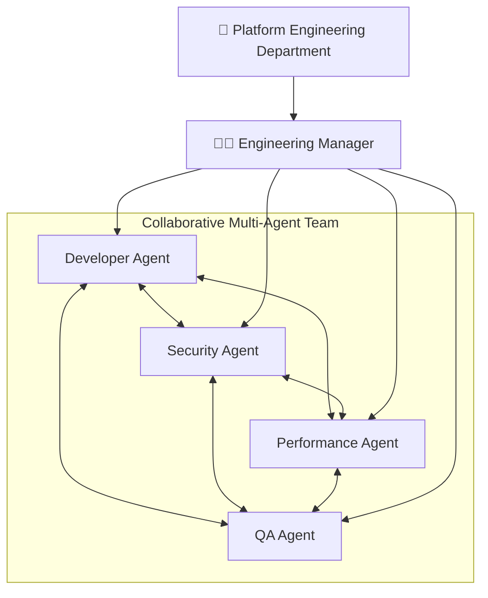
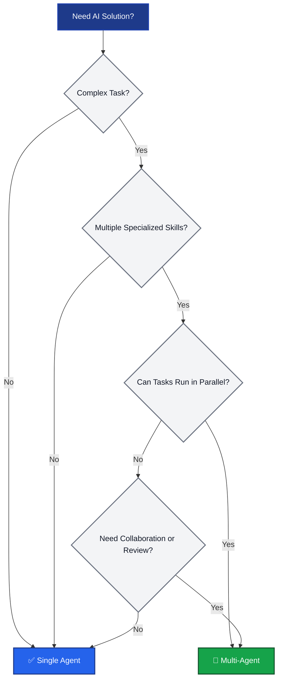
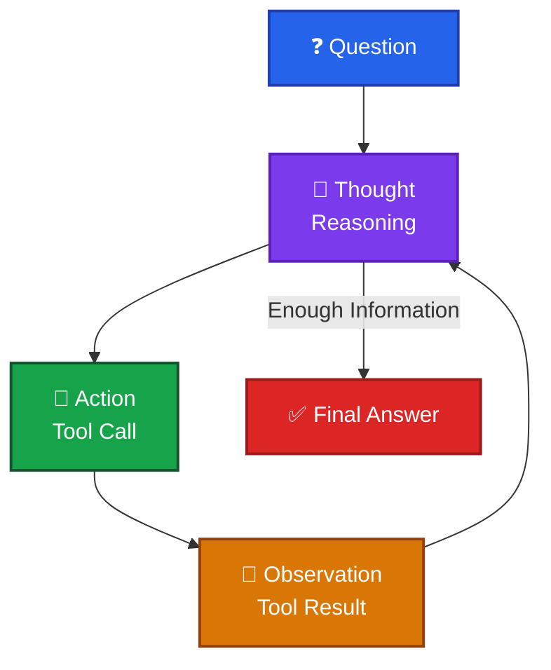
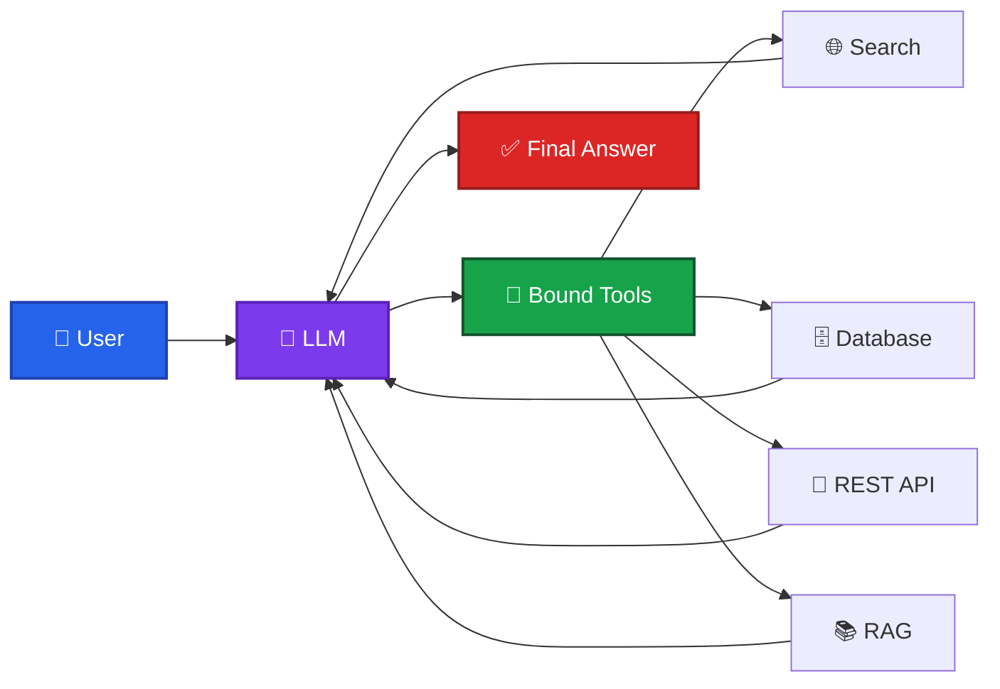
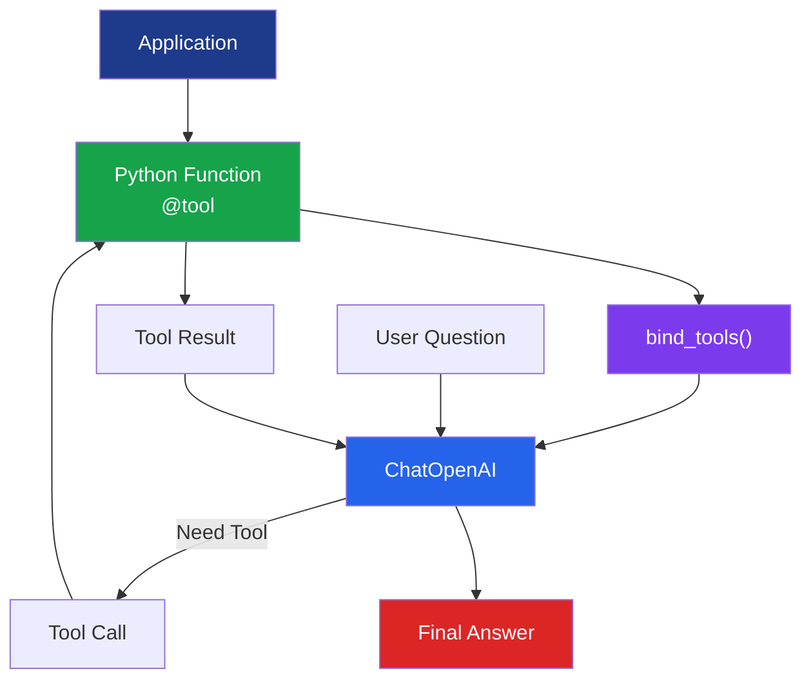
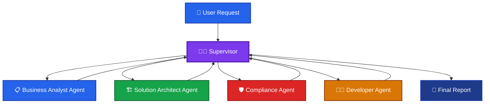
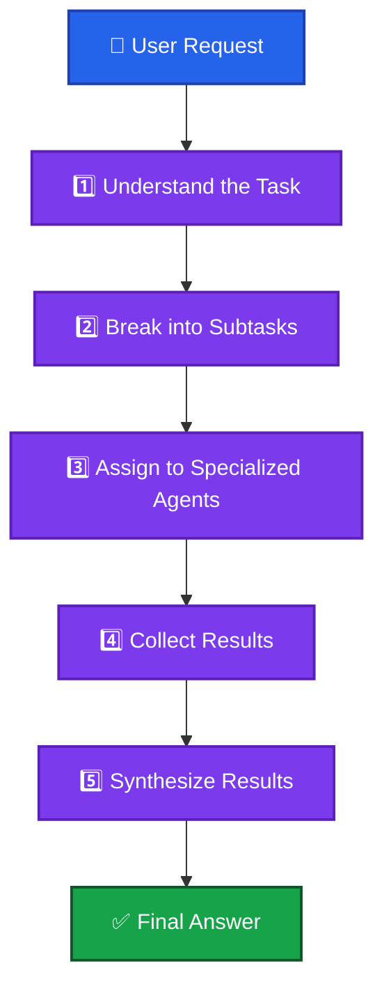

# Multi Agent System

## Why Multi Agent?

###　Single Agent

> One LLM does everything 

- ❌ Confused by complexity 
- ❌ No specialization 
- ❌ Hard to debug

### Multi-Agent



> ✅ Specialized, modular, debuggable

---

## Multi-Agent Patterns

| Pattern | Description | Typical Use Case |
|----------|-------------|------------------|
| **Supervisor** | One agent coordinates other agents. | **Complex** workflows |
| **Hierarchical** | Multiple levels of supervisors. | Large organizations - more supervisors |
| **Collaborative** | Agents communicate peer-to-peer. | Creative tasks |
| **Sequential** | Agents process tasks in order. | Processing pipelines |
| **Parallel** | Agents work simultaneously. | Speed optimization |

> This course focuses on the **Supervisor Pattern**.

### Collaborative Example



## When to Use Multi-Agent

### ✅ Good Fit

Use a Multi-Agent architecture when:

- Complex tasks with multiple distinct phases
- Specialized expertise is required
- Tasks can be executed in parallel
- Collaboration between multiple AI agents is beneficial
- Human-like team dynamics improve problem solving

#### Typical Examples

- Trade Finance processing
- Software Development
- Cybersecurity analysis
- Research & Report Generation
- Customer Service Automation

---

### ❌ Overkill For

A Multi-Agent architecture is usually unnecessary for:

- Simple Question & Answer
- Single-domain tasks
- Low-latency applications
- Small workflows with one clear objective
- Tasks that can be completed by a single LLM

#### Typical Examples

- Chatbot FAQ
- Text Translation
- Grammar Correction
- Sentiment Analysis
- Simple Summarization

---

### Mermaid（Decision Tree）



---

### 結合 Trade Finance 的實例

| Scenario                                     | Single Agent | Multi-Agent |
| -------------------------------------------- | ------------ | ----------- |
| LC 條款翻譯                                      | ✅            |             |
| 查詢 UCP600 條文                                 | ✅            |             |
| SWIFT MT700 Parsing                          | ✅            |             |
| LC 文件審核（UCP600 + ISBP + OFAC + AML）          |              | ✅           |
| Payment Hub Routing + FX + Compliance + Risk |              | ✅           |
| End-to-End Trade Finance Processing          |              | ✅           |

這個例子很符合企業實務。例如在你們規劃的 **AI Trade Finance Platform** 中，一個信用狀（LC）交易通常需要 **Parser Agent、UCP600 Agent、Compliance Agent、Risk Agent、Pricing Agent、Accounting Agent** 等多個專業 Agent 協同完成，因此屬於典型的 **Multi-Agent** 應用；反之，若只是查詢「UCP600 第 14 條內容」或「翻譯 LC 條款」，一個 **Single Agent** 即可完成，沒有必要增加 Multi-Agent 的複雜度。

---

## The React Pattern

> **ReAct = Reasoning + Acting**

ReAct is an AI agent pattern that alternates between **reasoning** and **taking actions**.  

The agent repeatedly **reasons**, invokes external tools (**acting**) when necessary, observes the results, and **loops** until it can produce a final answer.

---

### Workflow



---

### Step Descriptions

| Step | Description |
|------|-------------|
| Question | User request |
| Thought | Analyze the problem and decide the next step |
| Action | Invoke a tool (Search, Calculator, Database, API, RAG, etc.) |
| Observation | Receive the tool's output |
| Final Answer | Generate the response using all collected information |

---

### The ReAct Loop

1. Think about the problem.
2. Decide whether a tool is needed.
3. Execute the tool.
4. Observe the result.
5. Think again.
6. Repeat until sufficient information is available.
7. Produce the final answer.

---

### Typical Tool Examples

- Web Search
- RAG / Vector Database
- SQL Database
- Calculator
- Python
- REST API
- MCP Tool
- File System
- Email / Calendar

---

### Typical Use Cases

- AI Search Assistant
- Financial Analysis
- Trade Finance
- Coding Assistant
- Data Analysis
- Research Assistant

### Trade Finance 實例（ReAct）

假設使用者詢問：

> **"Which LC documents contain discrepancies according to UCP600?"**

ReAct Agent 的執行流程如下：

| Step             | Example                                                                                                                                |
| ---------------- | -------------------------------------------------------------------------------------------------------------------------------------- |
| **Question**     | Which LC documents contain discrepancies?                                                                                              |
| **Thought**      | I need the LC documents and the relevant UCP600 rules before I can determine discrepancies.                                            |
| **Action**       | Call the Document Parser Tool to extract document fields.                                                                              |
| **Observation**  | Invoice, Bill of Lading, and Insurance Certificate have been parsed.                                                                   |
| **Thought**      | I now need to validate these documents against UCP600 Article 14 and ISBP 821.                                                         |
| **Action**       | Call the UCP600/ISBP Validation Tool.                                                                                                  |
| **Observation**  | The Bill of Lading shows a shipment date later than the latest shipment date in the LC.                                                |
| **Thought**      | I have enough information to answer the user's question.                                                                               |
| **Final Answer** | The Bill of Lading contains a discrepancy because the shipment date exceeds the latest shipment date permitted by the LC under UCP600. |

這個例子展現了 ReAct 的核心精神：**思考（Reasoning）→ 使用工具（Acting）→ 觀察結果（Observation）→ 再思考**，直到收集到足夠資訊，再產生最終答案。這也是 LangGraph、OpenAI Agents SDK 等 Agent Framework 中常見的工作模式。

---

## Binding Tools to LLMs

### What is Tool Binding?

Tool Binding enables an LLM to invoke external tools (e.g., Search, Database, APIs, Calculator, RAG) whenever additional information or capabilities are required.

Rather than relying solely on its internal knowledge, the LLM can decide whether to call an appropriate tool before generating a response.

---

### Define & Bind Tools

```python
from langchain_openai import ChatOpenAI
from langchain_core.tools import tool

# (1) @tool decorator
@tool
def search(query: str) -> str:
    """Search the web."""
    return f"Results for: {query}"

llm = ChatOpenAI(model="gpt-4o-mini")

# (2) bind_tools()
llm_with_tools = llm.bind_tools([search])

# (3) Result
response = llm_with_tools.invoke(
    "What is the latest exchange rate for USD/TWD?"
)

print(response)
```

### How It Works

1. **@tool decorator** — Docstring becomes the tool description for the LLM
2. **bind_tools()** — Attaches tools to LLM so it can call them
3. **Result** — LLM can now decide when to use the search tool

---

### Common Tool Examples

- Web Search
- Calculator
- SQL Database
- REST API
- RAG Retriever
- Python
- File System
- Email
- Calendar
- MCP Tools

---

### Benefits

- Access real-time information
- Reduce hallucinations
- Connect enterprise systems
- Automate business workflows
- Enable Agentic AI

---

### Mermaid（Tool Binding）



---

### LangChain Architecture



---

### Trade Finance 範例

假設使用者詢問：

> **"Show me the latest USD/TWD exchange rate and calculate the LC issuance commission."**

Agent 的執行流程如下：

| Step         | Action                                 |
| ------------ | -------------------------------------- |
| User         | 詢問最新 USD/TWD 匯率並計算 LC 開狀手續費            |
| LLM          | 判斷需要即時匯率，因此無法僅依靠模型知識回答                 |
| Tool 1       | 呼叫 FX Rate API 取得最新 USD/TWD 匯率         |
| Observation  | 收到即時匯率，例如 30.18                        |
| Tool 2       | 呼叫 Commission Calculator，依照銀行費率計算開狀手續費 |
| Observation  | 回傳手續費金額                                |
| Final Answer | 向使用者提供最新匯率與計算完成的手續費                    |

這個例子展示了 **Tool Binding** 的核心價值：LLM 不只是生成文字，而是能根據需求主動選擇並呼叫適當的工具，取得最新資料、執行業務邏輯，再整合結果回覆使用者。這正是 **Agentic AI** 的重要能力，也是 LangChain、LangGraph、OpenAI Agents SDK 等框架的共同設計理念。

---

## Hands on Tool Calling Agent

```bash
cd langchain-course/
pyenv global 3.12.10
pyenv local 3.12.10

uv run tool_calling_agent.py
```

## Supervisor Core Responsibilities - Supervisor Pattern

The **Supervisor** is the coordinator of a Multi-Agent system. Rather than performing every task itself, it delegates work to specialized agents, gathers their outputs, and delivers the final result.

---

### 1. Understand the Task

- Parse the user's intent and requirements.
- Identify the overall objective.
- Determine whether the task is simple or requires multiple agents.

**Example**

> "Review a Business Analysis Specification."

---

### 2. Break It into Subtasks

- Decompose a complex request into manageable subtasks.
- Define dependencies and execution order.
- Determine which tasks can run in parallel.

**Example**

- Requirement Review
- Technical Feasibility Analysis
- Risk Assessment
- Document Quality Review

---

### 3. Route to the Appropriate Agent

- Select the most suitable specialist for each subtask.
- Dispatch work to one or more agents.
- Execute sequentially or in parallel as appropriate.

**Example**

| Subtask | Assigned Agent |
|---------|----------------|
| Requirement Analysis | Business Analyst Agent |
| Architecture Review | Solution Architect Agent |
| Code Review | Developer Agent |
| Risk Assessment | Compliance Agent |

---

### 4. Collect and Synthesize Results

- Gather outputs from all participating agents.
- Resolve conflicts or inconsistencies.
- Merge the results into a coherent response.

**Example**



---

### 5. Decide When the Task Is Complete

- Determine whether sufficient information has been collected.
- Decide whether additional agent iterations are required.
- Produce the final answer and terminate the workflow.

**Decision Criteria**

- All subtasks completed
- No unresolved conflicts
- Required confidence achieved
- User objective satisfied

---

### Typical Workflow



---

### Typical Use Cases

- AI Coding Assistant
- Trade Finance Processing
- Financial Analysis
- Software Development
- Customer Service Automation
- Enterprise Workflow Automation

---

### Supervisor Resposibilities Summary

| Step | Responsibility | Description |
|------|----------------|-------------|
| **1** | **Understand the Task** | Parse the user's intent, requirements, and overall objective. |
| **2** | **Break into Subtasks** | Decompose complex work into smaller, manageable tasks. |
| **3** | **Route to the Appropriate Agent** | Select the most suitable specialist or AI agent for each subtask. |
| **4** | **Collect and Synthesize Results** | Gather outputs from all agents, resolve conflicts, and combine them into a coherent result. |
| **5** | **Decide When the Task Is Complete** | Determine whether sufficient information has been collected and produce the final response. |

---

## Hands on - Supervisor Patterns 

```bash
uv run supervisor_agent.py 
```
