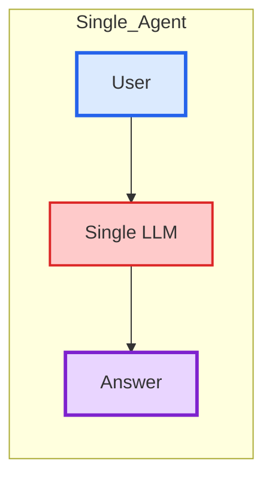
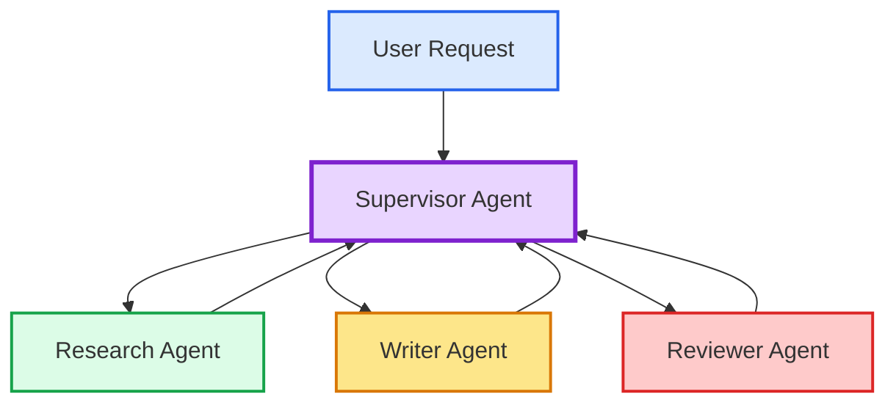

# Multi Agent System

## Why Multi Agent?

###　Single Agent

> One LLM does everything 

- ❌ Confused by complexity 
- ❌ No specialization 
- ❌ Hard to debug

### Multi-Agent

> ✅ Specialized, modular, debuggable

---

## Multi-Agent Patterns

| Pattern | Description | Typical Use Case |
|----------|-------------|------------------|
| **Supervisor** | One agent coordinates other agents. | **Complex** workflows |
| **Hierarchical** | Multiple levels of supervisors. | Large organizations |
| **Collaborative** | Agents communicate peer-to-peer. | Creative tasks |
| **Sequential** | Agents process tasks in order. | Processing pipelines |
| **Parallel** | Agents work simultaneously. | Speed optimization |

> This course focuses on the **Supervisor Pattern**.
