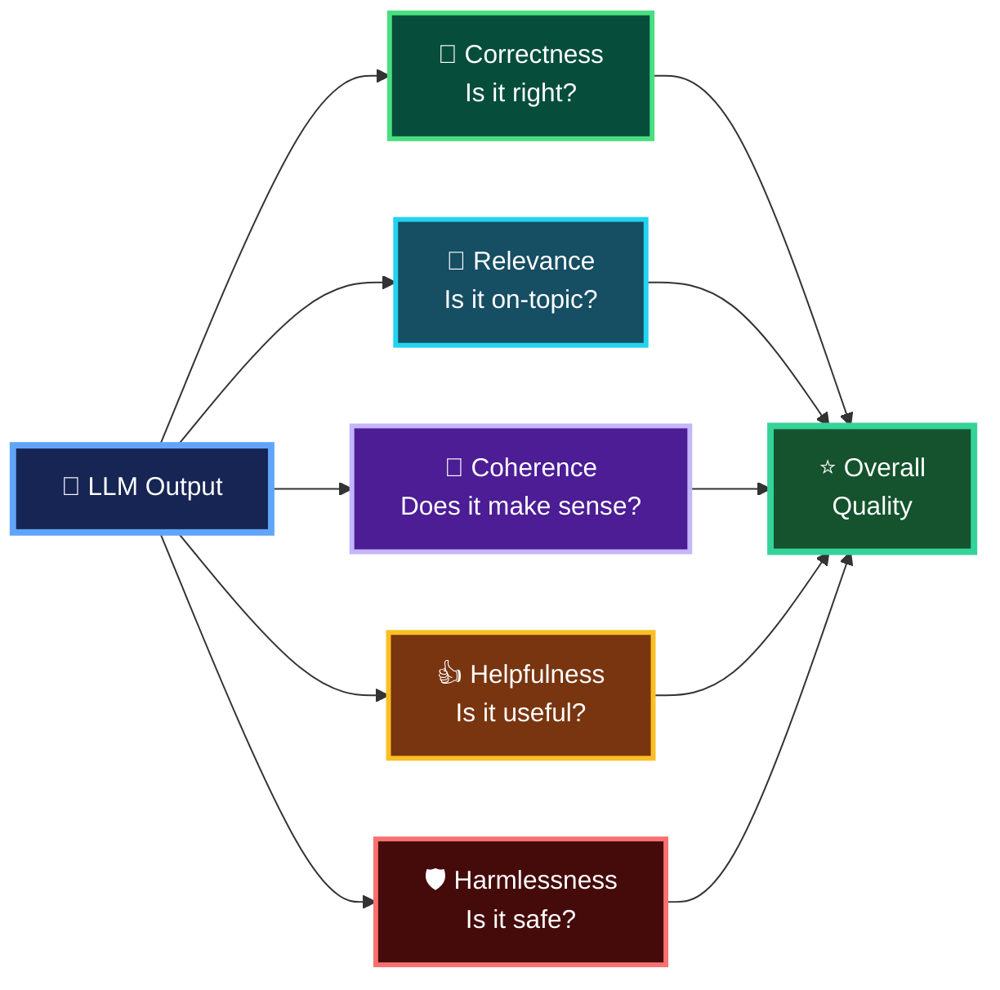
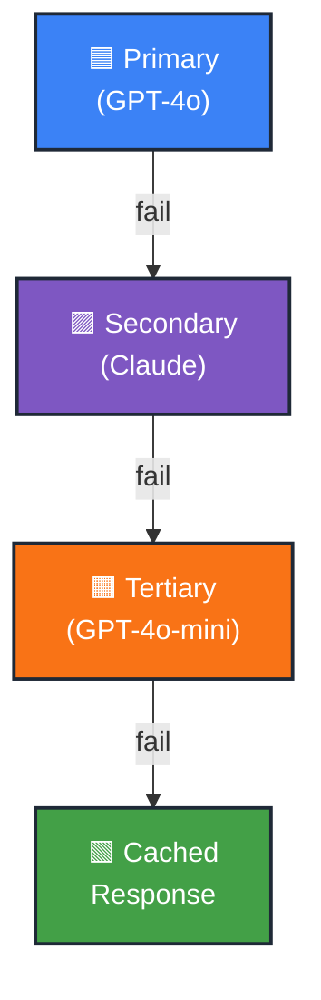

# LLM Testing Patterns

> Why Testing LLMs Is Different, Traditional software testing and LLM testing require different approaches because LLM applications produce **probabilistic outputs** rather than strictly deterministic results.

## Traditional Testing vs. LLM Testing

| Traditional Testing | → | LLM Testing |
|---|:---:|---|
| ✅ **Deterministic Outputs** | → | 🎲 **Probabilistic Outputs** |
| 🟰 **Exact Match Assertions** | → | ≈ **Semantic Evaluation** |
| ⚡ **Fast Execution** | → | ⏳ **Slow, Expensive** |
| 📦 **Isolated Units** | → | 🔗 **Complex Chains** |

---

# LLM Testing Strategies

LLM / Agent applications typically require multiple testing strategies because model outputs are **probabilistic** and workflows may involve multiple LLMs, Agents, Tools, and Prompts.

## Four Testing Strategies

| Testing Strategy | Main Purpose | Key Approach |
|---|---|---|
| 🧩 **Unit Tests** | Test individual components | **Mock LLM responses** |
| ✅ **Integration Tests** | Test the real integrated workflow | **Real LLM with evaluation metrics** |
| 🔄 **Regression Tests** | Detect quality or behavior degradation | **Detect prompt drift / behavior changes** |
| 🅰️🅱️ **A/B Tests** | Compare alternative implementations | **Compare prompt versions** |

---

## Testing Architecture

```mermaid
flowchart TD

    T["🧪 LLM Testing Strategies"]

    U["🧩 Unit Tests<br/>Mock LLM Responses"]
    I["✅ Integration Tests<br/>Real LLM + Eval Metrics"]
    R["🔄 Regression Tests<br/>Detect Prompt Drift"]
    AB["🅰️ / 🅱️ A/B Tests<br/>Compare Prompt Versions"]

    T --> U
    T --> I
    T --> R
    T --> AB

    style T fill:#172554,stroke:#60A5FA,stroke-width:4px,color:#FFFFFF

    style U fill:#164E63,stroke:#38BDF8,stroke-width:3px,color:#FFFFFF
    style I fill:#064E3B,stroke:#4ADE80,stroke-width:3px,color:#FFFFFF
    style R fill:#78350F,stroke:#FB923C,stroke-width:3px,color:#FFFFFF
    style AB fill:#4C1D95,stroke:#E879F9,stroke-width:3px,color:#FFFFFF
````

## 1. Unit Tests

> **Mock LLM responses**

測試單一 Function、Node、Agent 或其他 component，而不是每次都真正呼叫 LLM。

```text
Input
  ↓
Component / Node
  ↓
Mock LLM Response
  ↓
Assert Expected Behavior
```

主要優點：

* Fast
* Cheap
* Deterministic
* Suitable for CI/CD
* Easier to isolate failures

---

## 2. Integration Tests

> **Real LLM with evaluation metrics**

使用真正的 LLM 測試多個元件整合後的行為。

```text
Input
  ↓
Agent
  ↓
Real LLM
  ↓
Tools / RAG
  ↓
Output
  ↓
Evaluation Metrics
```

因為 LLM Output 不一定每次文字完全相同，所以通常不能只依賴 Exact Match，而需要評估：

* Correctness
* Relevance
* Faithfulness / Groundedness
* Completeness
* Safety

---

## 3. Regression Tests

> **Detect prompt drift**

當 Prompt、Model、Tools、RAG Data 或 Agent Workflow 改變後，確認原本正常的能力沒有退步。

```text
Baseline
   │
   ├── Prompt V1
   ├── Model V1
   └── Expected Quality
          ↓
       Change
          ↓
   Prompt / Model / Agent V2
          ↓
      Re-evaluate
          ↓
Regression?
```

核心問題：

> **新版是否讓原本好的結果變差？**

---

## 4. A/B Tests

> **Compare prompt versions**

比較兩種 Prompt、Model 或 Agent Strategy 的實際效果。

```text
             Test Dataset
                  │
          ┌───────┴───────┐
          ▼               ▼
     Version A        Version B
     Prompt A         Prompt B
          │               │
          ▼               ▼
      Eval Score       Eval Score
          └───────┬───────┘
                  ▼
             Compare
```

例如：

| Metric      |  Prompt A | Prompt B |
| ----------- | --------: | -------: |
| Correctness |      0.82 | **0.91** |
| Relevance   |      0.88 | **0.93** |
| Latency     |  **2.1s** |     2.8s |
| Cost        | **$0.02** |    $0.03 |

因此 A/B Testing 不一定只比較「誰回答比較好」，還可以同時比較：

**Quality + Latency + Token Usage + Cost**

---

## Key Takeaway

> **Unit Test** → Does each component work?

> **Integration Test** → Does the complete workflow work with a real LLM?

> **Regression Test** → Did the new version make anything worse?

> **A/B Test** → Which version performs better?

---

# Evaluation Metrics

LLM Evaluation 不能只看「答案是否完全一致」，而需要從多個品質維度評估模型輸出。

## Evaluation Metrics

| Metric | What It Measures | When to Use |
|---|---|---|
| 🎯 **Correctness** | **Is the answer right?** | Q&A, factual tasks |
| 🔗 **Relevance** | **Is it on-topic?** | RAG, retrieval |
| 🧩 **Coherence** | **Does it make sense?** | Generation |
| 👍 **Helpfulness** | **Is it useful?** | Assistants |
| 🛡️ **Harmlessness** | **Is it safe?** | All production apps |

---

## 1. Correctness — 答得對不對？

衡量答案在**事實、邏輯或預期結果上是否正確**。

```text
Question
   ↓
LLM Answer
   ↓
Compare with Ground Truth
   ↓
Correct?
````

**適合：**

* Q&A
* Factual Questions
* Calculation
* Business-rule questions

> **Correctness = Is the answer right?**

---

## 2. Relevance — 有沒有回答到問題？

衡量回答是否與使用者問題或檢索目標**直接相關**。

例如：

```text
Question:
"What is LangGraph Send API used for?"

Answer:
"Send supports dynamic task dispatch and fan-out."

→ High Relevance ✓
```

如果回答大量介紹 LangChain 歷史，但沒有回答 `Send`：

```text
→ Low Relevance ✗
```

**特別適合：RAG / Retrieval**

> **Relevance = Is it on-topic?**

---

## 3. Coherence — 回答是否通順、有邏輯？

即使每一句話單獨看都正確，整體也可能前後矛盾或沒有邏輯。

衡量：

* Logical flow
* Internal consistency
* Readability
* Structure
* Whether the answer makes sense as a whole

> **Coherence = Does it make sense?**

---

## 4. Helpfulness — 對使用者有沒有用？

答案可能：

```text
Correct ✓
Relevant ✓
Coherent ✓
```

但仍然可能：

```text
Too vague
Missing actionable details
Doesn't solve user's problem

→ Not Helpful ✗
```

因此 Helpfulness 更關心：

> **這個答案實際上是否幫助使用者完成目標？**

**特別適合：AI Assistants / Agents**

---

## 5. Harmlessness — 是否安全？

衡量模型輸出是否造成不必要的安全或內容風險。

例如：

* Unsafe content
* Harmful instructions
* Privacy / PII leakage
* Inappropriate content
* Policy violations

**適合所有 Production LLM Applications。**

> **Harmlessness = Is it safe?**

---

## Evaluation Model



## Easy Way to Remember

> **Correctness** → 對不對？

> **Relevance** → 有沒有答到題？

> **Coherence** → 通不通順、有沒有邏輯？

> **Helpfulness** → 有沒有實際幫助？

> **Harmlessness** → 安不安全？


---

# Hands On Test Patterns

```bash
uv run testing_patterns.py 
```

> LangSmith -> Datasets & Experiments > qa-eval-dataset

---

```bash
uv run testing_patterns1_testCases.py
uv run testing_patterns2_prodDataset.py
```

| 对比项 | v1（Step 2） | v2（Step 3） |
|---|---|---|
| 所在函数 | `run_evaluation()` | `run_comparison()` |
| 使用的链 | 模块级 `v1_chain = prompt \| LLM` | 函数内新建 `v2_chain = detailed_prompt \| LLM` |
| Prompt 内容 | `"Answer this question concisely: {question}"`（简单版） | 更详细的指令:要求精确、事实类问题要准确、数学题只给答案 |
| 目标函数 | `qa_target_v1` | `qa_target_v2`（函数内嵌套定义） |
| `@traceable` 名称 | `"qa_target_v1"` | `"qa_target_v2"` |
| `experiment_prefix` | `"qa-chain-v1"` | `"qa-chain-v2"` |
| 使用的数据集 | `qa-eval-dataset`（相同） | `qa-eval-dataset`（相同） |
| 评估器 | `correctness`、`helpfulness`、`contains_answer`（相同） | `correctness`、`helpfulness`、`contains_answer`（相同） |
| `max_concurrency` | `2`（相同） | `2`（相同） |
| 结果打印标签 | `print_results(results, "v1")` | `print_results(results, "v2")` |
| 作用/目的 | 建立基线(baseline)评测结果 | 换了 prompt 后重新跑一遍,用来和 v1 在 LangSmith 面板里做 Compare Experiments |

**核心结论**:两次调用的评测框架(数据集、评估器、并发数)完全相同,唯一的自变量是 **prompt 和对应的链**——v2 想验证的是"更详细的 prompt 指令是否能提升回答质量"。`experiment_prefix` 不同只是为了在 LangSmith 里把两次实验分开标记,方便对比。

---

# The Testing Pyramid for LLM Applications

## Testing Pyramid for LLM Applications

| Frequency | Testing Level | Purpose | When to Run |
|---|---|---|---|
| 🟪 **Least Frequent** | **LangSmith Datasets** | Persistent, versioned evaluation datasets | **Weekly / Before deploy** |
| 🟧 ↓ | **Regression Tests** | Detect LLM/application quality drift | **Nightly** |
| 🟦 ↓ | **Integration Tests** | Test with a real LLM and perform keyword/response checks | **Before deploy** |
| 🟩 **Most Frequent** | **Unit Tests (Mocks)** | Free, fast; test your own code; no API calls needed | **Every commit** |

### Core Concept

**Least Frequent / Higher Cost**
  
🟪 LangSmith Datasets  
↓  
🟧 Regression Tests  
↓  
🟦 Integration Tests  
↓  
🟩 Unit Tests (Mocks)

**Most Frequent / Lower Cost**

核心概念就是：**越往下越便宜、越快、越頻繁；越往上越接近真實 LLM 品質驗證，但成本較高、執行頻率較低。**

---

## Production Error Scenarios

| Error Type    | Cause             | Impact              |
|---------------|-------------------|---------------------|
| API Timeout   | Network issues    | User wait, retry    |
| Rate Limit    | Too many requests | Queue, backoff      |
| Token Limit   | Input too long    | Truncate, summarize |
| Model Error   | API issues        | Fallback model      |
| Parse Error   | Bad output        | Retry, default      |

---

## Exponential Backoff Retry Strategy

| Attempt | Wait Time |
|---|---:|
| 1🟩 **Attempt 1** | **1s** |
| 2🟨 **Attempt 2** | **2s** |
| 3🟧 **Attempt 3** | **4s** |
| 4🟥 **Attempt 4** | **8s (max)** |

> Each retry waits twice as long: 1s -> 2s -> 4s -> 8s (max)

---

# Fallback Chain

> If primary fails, try secondary. If all fail, serve cached response.

## LLM Fallback Chain



---

## Hands on Error Handling

```bash
uv run error_handling.py
uv run py -m pytest tests/test_robust_agent.py -v
```

`demo_robust_agent()` 是這個檔案最後一個示範,展示如何把錯誤處理和重試**直接建在 LangGraph 的圖結構裡**,而不是像前面幾個示範那樣寫在函式或類別裡。

前面三個示範各自展示一種獨立的模式:

| 示範 | 模式 |
|---|---|
| `demo_retry_pattern` | 用裝飾器做**指數退避**重試 |
| `demo_circuit_breaker` | 失敗太多就暫時斷路 |
| `demo_fallback_chain` | 一個模型失敗就換下一個 |
| **`demo_robust_agent`** | **用圖的節點和條件邊來做重試與錯誤處理** |

它的運作方式([error_handling.py:286-345](langchain-course/error_handling.py#L286-L345)):

1. `process` 節點:有 30% 機率丟出模擬錯誤(前提是 `retry_count < 2`),否則呼叫 LLM。失敗時不丟例外,而是把 `error` 和加 1 的 `retry_count` 寫進 state。
2. `should_continue` 條件邊:根據 state 決定下一步。
   - 成功 → `finalize` → 結束。
   - 失敗但 `retry_count < max_retries` → 回到 `process` 重試(圖裡的循環就是重試機制)。
   - 重試用完 → `handle_error` → 回傳道歉訊息 → 結束。
3. demo 跑 3 次,每次印出是否成功、用了幾次重試、以及回應內容。

重點是:**重試是圖的拓撲決定的**,`process` 節點自己不迴圈。這和你專案 CLAUDE.md 裡 `langchain-production-api` 的做法一致(`max_retries=0`,靠圖來重試)。好處是每次重試都是圖上的一個步驟,可以被 checkpoint、追蹤和視覺化。

因為模擬失敗只在 `retry_count < 2` 時才會發生,所以這個 demo 幾乎一定會成功,「重試用完」的 `handle_error` 分支通常走不到。要看到那條路徑,可以把失敗條件拿掉,或把失敗機率調高。

---

## demo_robust_agent()

- `RobustState` 新增 `simulated_failures` 欄位，表示這次要模擬失敗幾次。
- `process_with_retry` 改成 `retry_count < simulated_failures` 就失敗，不再用 `random`，每次結果都一樣。
- `demo_robust_agent` 改成跑三個情境。

**實際執行結果**

| 情境 | simulated_failures | Retries used | 路徑 |
|---|---|---|---|
| 1 | 0 | 0 | 直接 `finalize`，✅ |
| 2 | 2 | 2 | retry 兩次後 `finalize`，✅ |
| 3 | 3 | 3 | retry 用完後走 `handle_error`，❌ |

情境 3 印出 `❌ Failed`，是因為 `handle_error` 沒有把 `success` 設為 `True`，屬於預期行為。

`random` 在檔案的其他 demo 裡還有用到，所以我沒有移除 import。

---

# Cost Optimization Strategies

*Source: Production AI Agents with LangChain + LangGraph — Lecture 143, "Hands-on: Cost Reduction - Model Router"*

- **Model Routing**: Use cheap models for simple tasks
- **Caching**: Don't pay twice for the same query
- **Token Budgeting**: Set limits per request/user
- **Prompt Optimization**: Shorter prompts = lower costs

---

# LLM Cost Breakdown

*Source: Production AI Agents with LangChain + LangGraph — Lecture 143, "Hands-on: Cost Reduction - Model Router"*

> Output tokens cost 4–5x more than input tokens.

| Model         | Input (per 1M tokens) | Output (per 1M tokens) |
|---------------|----------------------:|-----------------------:|
| GPT-4o        | $2.50                 | $10.00                 |
| GPT-4o-mini   | $0.15                 | $0.60                  |
| Claude Sonnet | $3.00                 | $15.00                 |
| Claude Haiku  | $0.25                 | $1.25                  |

> Opus 5.5 is $4 / $20. The top tier, Fable 5.1, is $10 / $50.

---

## Hands on Cost Optimation

```bash
uv run cost_optimization.py
```
