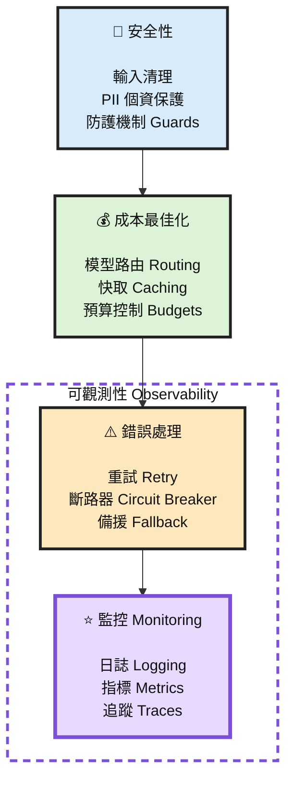

# 生產環境可視性的三大支柱
## Three Pillars of Production Visibility

> **系統正常運作嗎？速度夠快嗎？成本高嗎？是不是出問題了？**  
> Is it working? Is it fast? Is it expensive? Is it breaking?

## Production Visibility — 生產環境可視性

生產環境的可視性建立在三大核心支柱上：

| Layer | Pillar | 核心問題 / 目的 |
|---|---|---|
| **Layer 1** | **Structured Logging（結構化日誌）** | **發生了什麼？** |
| **Layer 2** | **Metrics Collection（指標收集）** | **發生了多少/量有多大？** |
| **Layer 3** | **Instrumented LLM（LLM 可觀測性埋點）** | **追蹤每一次 LLM 呼叫** |

---

## 1. Structured Logging — 結構化日誌

**目的：了解系統「發生了什麼」。**

- 以人可以閱讀及理解的方式記錄事件
- 記錄 Application / Agent 的執行過程
- 協助分析錯誤及異常行為
- 提供每一個 Request / Workflow 的執行上下文

> **Structured Logging = What happened? = 發生了什麼？**

---

## 2. Metrics Collection — 指標收集

**目的：了解「發生了多少」以及系統運作狀況。**

主要可以收集：

- Latency（延遲）
- Request Count（請求數）
- Error Rate（錯誤率）
- Token Usage（Token 使用量）
- LLM Cost（LLM 成本）
- Throughput（吞吐量）
- Performance Trends（效能趨勢）

這些數據主要提供給：

- Dashboard
- Monitoring
- Alerting
- Performance Analysis
- Cost Analysis

> **Metrics Collection = How much happened? = 發生了多少？**

---

## 3. Instrumented LLM — LLM 可觀測性埋點

**目的：對每一次 LLM 呼叫建立完整的可觀測性。**

可以追蹤：

- Model Request
- Model Response
- Prompt
- Latency
- Token Consumption
- Cost
- Error
- Retry
- Model Call

它把：

**Structured Logging + Metrics Collection**

整合到每一次 LLM Call 中。

> **Instrumented LLM = Ground every LLM call**
>
> **讓每一次 LLM 呼叫都有可以追蹤、分析及量化的依據。**

---

## 三者關係

```text
                    Production Visibility
                      生產環境可視性
                            │
          ┌─────────────────┼─────────────────┐
          │                 │                 │
          ▼                 ▼                 ▼
 Structured Logging   Metrics Collection   Instrumented LLM
     結構化日誌            指標收集          LLM 可觀測性埋點
          │                 │                 │
          ▼                 ▼                 ▼
     發生了什麼？        發生了多少？       每一次 LLM Call
     What happened?     How much happened?    都可追蹤
          │                 │                 │
          ▼                 ▼                 ▼
   Human-readable      Numbers for       Logging + Metrics
       Story             Dashboards          整合
```

---

## Summary — 總結

**Production Visibility =**

**Structured Logging + Metrics Collection + Instrumented LLM**

也就是：

**生產環境可視性 = 結構化日誌 + 指標收集 + LLM 呼叫可觀測性**

這三大支柱共同回答四個最重要的 Production 問題：

1. **Is it working?** — 系統有正常運作嗎？
2. **Is it fast?** — 系統速度夠快嗎？
3. **Is it expensive?** — LLM / 系統成本是否過高？
4. **Is it breaking?** — 系統是否正在發生異常或故障？

---
# How Monitoring Fits with Previous Patterns

> Monitoring is the outermost layer - it observes everything but doesn't change behavior



底下那句建議翻成：

> **監控層包覆並觀測上方所有層級。**

或更專業一點：

> **Monitoring / Observability 橫跨整個 Production Stack，對所有上層能力進行持續觀測。**

---

# Monitoring Hands on

```bash
uv run monitoring.py
```

---
