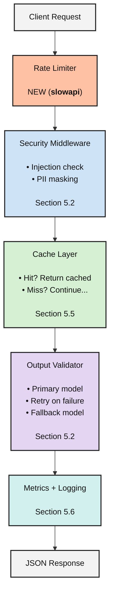

# Production-Ready API
## Full Implementation Guide

| Feature | Section | What It Does |
|---|---:|---|
| **LangSmith tracing** | 5.1 | Every request traced with metadata |
| **Input sanitization** | 5.2 | Blocks prompt injection attempts |
| **PII detection / masking** | 5.2 | Redacts emails, SSNs, cards before LLM |
| **Error handling + retries** | 5.4 | Exponential backoff, model fallbacks |
| **Response caching** | 5.5 | In-memory cache for duplicate calls |
| **Rate limiting** | NEW | Per-IP throttling with `slowapi` |
| **Structured logging** | 5.6 | JSON logs for production aggregation |
| **Metrics collection** | 5.6 | Request count, latency, token usage |
| **Health checks** | 5.7 | `/health` endpoint for Docker |
| **Docker deployment** | 5.7 | `Dockerfile` + `docker-compose` ready |

> Combines **EVERY concept from Section 5** into a single, deployable system.

---

# Production LLM API Request Flow



流程如下：

**Client Request → Rate Limiter → Security Middleware → Cache Layer → Output Validator → Metrics + Logging → JSON Response**

其中：

- **Rate Limiter**：限制 API 呼叫頻率
- **Security Middleware**：檢查 Prompt Injection、PII Masking
- **Cache Layer**：命中快取則直接回傳；未命中則繼續
- **Output Validator**：Primary Model、Retry、Fallback Model
- **Metrics + Logging**：記錄 latency、token、errors、logs
- **JSON Response**：回傳最終結果

---

```bash
git clone https://github.com/pdichone/lang-production-api.git
mv lang-production-api/ production-api/
cd production-api/

cp ../langchain-course/.env .env
pyenv local 3.12.10
pyenv global 3.12.10
pyenv versions 

uv sync

bash Production-test-commands.sh 

uv run python main.py
uv run pytest tests/ -v
```

---
